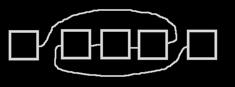

[bsoj5089 文本编辑器](https://oj.bashu.com.cn/code/problempage.php?problem_id=5089)

```
题意描述

九发明了一个完美的文本编辑器。这个编辑器拥有两个光标（cursor），所以九能够同时在两处地方插入和删除文本。这个编辑器除了正常的编辑功能以外，还有一些只有九才知道用处的功能，例如翻转两个光标之间的文本。某一天，九把自己的完美文本编辑器给弄丢了，但是她还有好多好多文本需要处理。于是她想请聪明又智慧的你帮她实现完美文本编辑器的一些功能。 
功能列表如下：

功能名称		命令格式	说明
< (move left)	< w	w	为一个字符，“L”或“R”，表示左光标还是右光标（下同）。该命令将选定光标向左移动，如果已经是最左端则不移动。命令执行成功时输出“T”，若光标已经在最左端，则输出“F”。
> (move right)	> w	w	同上。与< 命令不同的是，该命令将光标向右移动。命令执行成功时输出“T”，若光标已经在最右端，则输出“F”。
I (insert)		I w c	同上。c 是一个可见字符(33≤ ascii 码 ≤ 126)，代表在该光标左侧插入该字符。该命令始终输出“T”。
D (delete)		D w	w	同上。代表删除该光标右侧的一个字符。命令执行成功时输出“T”，若光标右侧没有字符输出“F”。
R (reverse)	R			代表翻转左光标和右光标之间的字符。该命令只有左光标在右光标左侧时才能执行。（两光标重合时也不能执行）命令执行成功时输出“T”，否则输“F”。
S (show)	S			代表显示当前处理的文本。该命令只输出文本，不输出“T”和“F”。
开始时文本编辑器中有一定内容，左光标在第一个字符左，右光标在最后一个字符右。

注意：在插入和删除操作中，没有被操作的光标与文本的相对左右位置保持不变。特别地，若两个光标重叠，操作后也仍然重叠。

输入格式

第一行是初始时文本编辑器内容。

第二行是一个正整数 N，N 表示操作次数。

接下来有 N 行，每行有一个命令，命令格式如上方表格。

输出格式

对于每个命令，按上方表格要求执行并输出。

样例输入

goodykc 
11 
I R u 
I R l 
> L 
> L 
> L 
> L 
R 
D R 
< R 
D R 
S

样例输出

T 
T 
T 
T 
T 
T 
T 
F 
T 
T 
goodluck

样例解释

[goodykc] 
[goodykcu] 
[goodykcul] 
g[oodykcul] 
go[odykcul] 
goo[dykcul] 
good[ykcul] 
good[lucky] 
good[lucky]（光标右边没有字符，失败删除） 
good[luck]y 
good[luck] 
goodluck

数据规模与约定

对于 40% 的数据：1 ≤ N , 初始文本长度 ≤ 100，数据不包含翻转（Reverse）操作；
另有 30% 的数据：1 ≤ N , 初始文本长度 ≤ 105，数据不包含翻转（Reverse）操作；
另有 20% 的数据：1 ≤ N , 初始文本长度 ≤ 105，数据包含翻转（Reverse）操作；
对于 100% 的数据：1 ≤ N , 初始文本长度 ≤ 4 × 106，输出文件大小 ≤ 20MB;
```

没找到这道题的出处

我不知道为啥有人用splay还有什么双端队列做这道题

反正我考场一看这题就兴奋了

这不直接双向链表暴搞吗

Reverse就直接这样接一下就没了




不过这样将让双向链表无法判断左右方向，那就直接将双向链表变成无向的，指针记录真实的在左边的那个节点的编号，这样就像遍历树那样可以判方向了

考场3kb 70pt，考后+2kb 加上了rev操作

代码权当纪念，诸位看看笑笑就好

反正我是已经看不懂了:p

各种结构体引用三目运算符函数混乱毫无可读性的5kb代码

```c++
#include<iostream>
#include<cstdio>
#include<cmath>
#include<cstring>
#include<ctime>
#include<cstdlib>
#include<algorithm>
#include<queue>
#include<vector>
#include<map>
using namespace std;
const int INF=999999999;

const int MXN=8E6+5;

struct Node{
	int v1,v2;
	char c;
}nd[MXN];int pN;
struct Pter{
	int id,pre;
	/*void Debug(){
		cout<<"Pter:"<<id<<"#"<<pre<<endl;
	}*/
}p1,p2;
Pter Copy(Pter& A){
	Pter B=(Pter){A.id,A.pre};
	return B;
}
bool IsOK(Pter p){
	if(p.id==0||(p.id==INF&&p.pre==INF)) return 0;
	return 1;
}

char str[MXN];int rpL,rpR;
void Build(){
	int sLen=strlen(str);pN=sLen;
	for(int i=1;i<sLen;i++) nd[i].v2=i+1;
	for(int i=2;i<=sLen;i++) nd[i].v1=i-1;
	nd[1].v1=0;nd[sLen].v2=INF;
	for(int i=1;i<=sLen;i++) nd[i].c=str[i-1];
	nd[0].v1=-INF,nd[0].v2=1;
	p1.id=1;p1.pre=0;
	p2.id=INF;p2.pre=sLen;
	
	rpL=1;rpR=strlen(str)+1;
}
Pter Left(Pter& nw){
	int le=nw.pre;
	if(le==0) return (Pter){0,0};
	int lele=(nd[le].v1!=nw.id)?nd[le].v1:nd[le].v2;
	Pter p=(Pter){le,lele};
	return p;
}
Pter Right(Pter& nw){
	int id=nw.id;if(id==INF) return (Pter){INF,INF};
	int ri=(nd[id].v1==nw.pre)?nd[id].v2:nd[id].v1;
	Pter p=(Pter){ri,id};
	return p;
}
void Ins(Pter& nw,char c){
	pN++;nd[pN].c=c;
	int id=nw.id;
	Pter le=Left(nw);
	nd[pN].v1=le.id;nd[pN].v2=nw.id;
	
	int& leR=(nd[le.id].v1==id?nd[le.id].v1:nd[le.id].v2);
	leR=pN;
	
	if(IsOK(Right(nw))){
		int& nwL=(nd[id].v1==nw.pre?nd[id].v1:nd[id].v2);
		nwL=pN;
	}
	nw.pre=pN;
}
bool Del(Pter& nw){
	if(nw.id==INF){printf("F");return 0;}
	Pter le=Left(nw);
	Pter ri=Right(nw);
	
	int& leR=(nd[le.id].v1==nw.id?nd[le.id].v1:nd[le.id].v2);
	leR=ri.id;
	
	if(IsOK(Right(ri))){
		int& riL=(nd[ri.id].v1==nw.id?nd[ri.id].v1:nd[ri.id].v2);
		riL=le.id;
	}
	nw.id=ri.id;
	nw.pre=le.id;
	printf("T");
	return 1;
}
void Rev(){
	Pter L=Copy(p1);
	Pter LL=Left(L);
	Pter RR=Copy(p2);
	Pter R=Left(RR);
	//cout<<L.id<<","<<LL.id<<"#"<<R.id<<","<<RR.id<<"###";
	int& leleR=(nd[LL.id].v1==L.id?nd[LL.id].v1:nd[LL.id].v2);
	leleR=R.id;
	
	int& leL  =(nd[L.id].v1==LL.id?nd[L.id].v1:nd[L.id].v2);
	leL=RR.id;
	
	if(IsOK(Right(RR))){
		int& ririL=(nd[RR.id].v1==R.id?nd[RR.id].v1:nd[RR.id].v2);
		ririL=L.id;
	}
	int& riR  =(nd[R.id].v1==RR.id?nd[R.id].v1:nd[R.id].v2);
	riR=LL.id;
	
	
	p1.id=R.id;
	p2.pre=L.id;
}
void Print(){
	Pter p=(Pter){nd[0].v2,0};
	while(IsOK(Right(p))){//p.Debug();
		printf("%c",nd[p.id].c);
		p=Right(p);
		
	}
}

int main(){
	scanf("%s",str);
	Build();
	int qN;cin>>qN;
	for(int i=1;i<=qN;i++){
		char typ[2];scanf("%s",typ);
		char wch[2],ccc[2];
		switch(typ[0]){
			 case '<':{//cout<<"#";
				scanf("%s",wch);Pter& p=(wch[0]=='L')?p1:p2;
				Pter lp=Left(p);
				if(!IsOK(lp)) printf("F");
				else{
					printf("T");
					p=lp;
					((wch[0]=='L')?rpL:rpR) --;
				}
				//p.Debug();
				break;
			}case '>':{//cout<<"V";
				scanf("%s",wch);Pter& p=(wch[0]=='L')?p1:p2;
				Pter rp=Right(p);
				if(!IsOK(rp)) printf("F");
				else{
					printf("T");
					p=rp;
					((wch[0]=='L')?rpL:rpR) ++;
				}
				//p.Debug();
				break;
			}case 'I':{
				scanf("%s",wch);Pter& p=(wch[0]=='L')?p1:p2;
				Pter& otr=(wch[0]=='L')?p2:p1;
				int& ooo=(wch[0]=='L')?rpL:rpR;
				int& ppp=(wch[0]=='L')?rpR:rpL;
				scanf("%s",ccc);char c=ccc[0];
				int bomb=0;
				if(p.id==otr.id&&p.pre==otr.pre) bomb=1;
				Ins(p,c);
				printf("T");
				if(bomb==1) otr.id=p.id,otr.pre=p.pre;
				if(ooo<=ppp) ppp++;
				ooo++;
				break;
			}case 'D':{
				scanf("%s",wch);Pter& p=(wch[0]=='L')?p1:p2;
				Pter& otr=(wch[0]=='L')?p2:p1;
				int& ooo=(wch[0]=='L')?rpL:rpR;
				int& ppp=(wch[0]=='L')?rpR:rpL;
				int bomb=0;
				if(p.id==otr.id&&p.pre==otr.pre) bomb=1;
				else if(otr.pre==p.id) bomb=2;
				bool isSuc=Del(p);
				if(bomb==1) otr.id=p.id,otr.pre=p.pre;
				else if(bomb==2) otr.pre=p.pre;
				//p.Debug();otr.Debug();
				if(isSuc){
					if(ooo<ppp) ppp--;
				}
				break;
			}case 'R':{
				//printf("F");
				if(rpL<rpR){
					Rev();
					printf("T");
				}else{
					printf("F");
				} 
				break;
			}case 'S':{
				Print();
				break;
			}
		}
		//cout<<p1.id<<','<<p1.pre<<"|"<<p2.id<<","<<p2.pre<<endl;
		//cout<<"!"<<rpL<<','<<rpR;
		printf("\n");
	}
	return 0;
}
/*
ab
111
R
S

goodykc
11
I R u
I R l
> L
> L
> L
> L
R
D R
< R
D R
S
*/
```