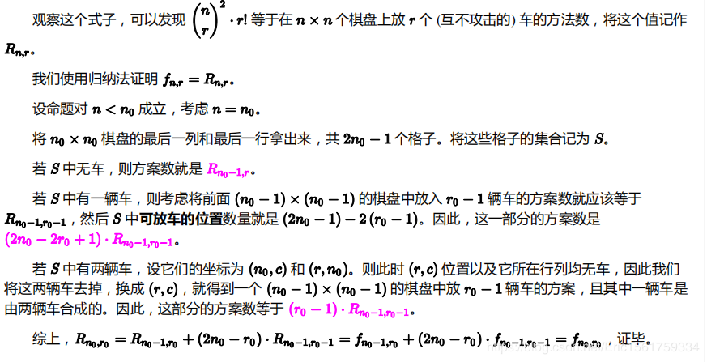

```
球（ball）
【问题描述】
小 T 有 n 个桶和 2n − 1 个球，其中第 i 个桶能装前 2i − 1 个球。每个桶只能装一个球。
现在小 T 取了 m 个桶和 m 个球，并将这些球各自放在这些桶里。问这样的方案有多少。
两种方案不同当且仅当选择了不同的桶或球或者同一个桶在两种方案放了不同的球。
由于方案的数量可能很大，所以只需要求方案数模 998244353 后的结果。
【输入格式】
从输入文件 ball.in 中读入数据。
第一行一个整数 T，表示数据组数。
接下来 T 行，每行两个整数 n, m，含义见【问题描述】。
【输出格式】
输出到文件 ball.out 中。
输出共 T 行，每行一个整数表示一组数据的答案。
【样例 1 输入】
4
1 1
2 1
2 2
3 2
【样例 1 输出】
1
4
2
18
【样例 1 说明】
对于 n = m = 1 的情况，只有选择第一个球和第一个桶，并将第一个球放在第一个桶里这一种方案。
对于 n = 2, m = 2 的情况，会选择所有桶，第一个桶里放的一定是第一个球，于是第二个桶里可以放第二个或第三个球，共两种方案。
【样例 2 输入】
4
1000 1
10000 1
100000 1
1000000 1
【样例 2 输出】
1000000
100000000
17556470
757402647
【子任务】
保证 1 ≤ T ≤ 1E5, 1 ≤ m ≤ n ≤ 1E7。
```

首先看到$10^7$的数据和仅有2个参数的较多询问，马上想到这是一道和预处理阶乘有关的题。

然后看题目，是一道计数题，结合前面的想法，预估是一道数学题，且很可能是结论题

然后就分析一下，桶可以选择的球的区间存在包含关系，前面的桶选择一个球放入后，后面的桶可选择的球就会减1，用式子表达即
$$
Ans= \sum_{i_1 = 1}^n \sum_{i_2 = i_1+1}^n \sum_{i_3 = i_2+1}^n  ... \sum_{i_m = i_{m-1}+1}^n (2 i_1 - 1)(2 i_2 - 2) ... (2i_m - m)
$$
对这种变量不重复的枚举方式，有一个常用的化法，就是反过来枚举，使每个变量的下界为$1$，方便后续化简
$$
\sum_{i_m = m}^{n} \sum_{i_{m-1} = m-1}^{i_m -1} \sum_{i_{m-2} = m-2}^{i_{m-1} -1} ... \sum_{i_{2} = 2}^{i_{3} -1} \sum_{i_{1} = 1}^{i_{2} -1} (2 i_1 - 1)(2 i_2 - 2) ... (2i_m - m)
$$
直接把每一项提出去得
$$
\sum_{i_m = m}^{n} (2i_m - m) \sum_{i_{m-1} = m-1}^{i_m -1} (2i_{m-1} - (m-1)) ... \sum_{i_{2} = 2}^{i_{3} -1} (2 i_2 - 2) \sum_{i_{1} = 1}^{i_{2} -1} (2 i_1 - 1)
$$
emm然后发现，这样的式子，从末尾开始，每一个求和都只与前一个求和给的变量有关，如果我们对最后一个求和预处理一下，然后用它来处理倒数第2个求和，然后用这来出来倒数第3个求和......处理到最后就是答案了！

实现就一个二维的dp
$$
f(0,j) = 1 \\
f(i,i-1) = 0 \\
f(i,j) = f(i,j-1) + (2j-i)f(i-1,j-1)
$$
那么，最终答案就是$f(m,n)$

这样就可以获得70分

观察推出来的式子，是不是挺像组合数的递推式？

考虑打表出$f$矩阵找规律

发现$f(i,i) = i!$，对每行都除掉他

发现每一个数字都是完全平方数，开方后就成为一个近似杨辉三角的东西

于是愉快的发现了规律。
$$
Ans = m! (C_n^m)^2
$$


```c++
#include<iostream>
#include<cstdio>
#include<cmath>
#include<cstring>
#include<ctime>
#include<cstdlib>
#include<algorithm>
#include<queue>
#include<vector>
#include<map>
using namespace std;
typedef long long ll;
const ll MOD=998244353;
ll QPow(ll x,ll up){
	x%=MOD;
	ll ans=1;
	while(up)
		if(up%2==0) x=x*x%MOD,up/=2;
		else ans=ans*x%MOD,up--;
	return ans;
}
ll Inv(ll x){return QPow(x,MOD-2);}
const ll MXN=1E7+5;

ll fac[MXN];
ll facInv[MXN];
void SpawnFac(ll sz){
	fac[0]=1;for(ll i=1;i<=sz;i++) fac[i]=fac[i-1]*i%MOD;
	facInv[sz]=Inv(fac[sz]);
	for(ll i=sz-1;i>=1;i--) facInv[i]=facInv[i+1]*(i+1)%MOD;
	facInv[0]=1;
}
ll C(ll n,ll m){
	if(n<m) return 0;
	return fac[n]*facInv[m]%MOD*facInv[n-m]%MOD;
}


int main(){
	//freopen("ball.in","r",stdin);
	//freopen("ball.out","w",stdout);
	SpawnFac(1E7+1);
	ll T;scanf("%lld",&T);while(T--){
		ll n,m;scanf("%lld%lld",&n,&m);
		ll ans=fac[m]*C(n,m)%MOD*C(n,m)%MOD;
		printf("%lld\n",ans);
	}
	return 0;
}
```

这个结论题还是蛮有意思的，推导套路值得思考

关于该结论的证明：




反正我是没有看懂（