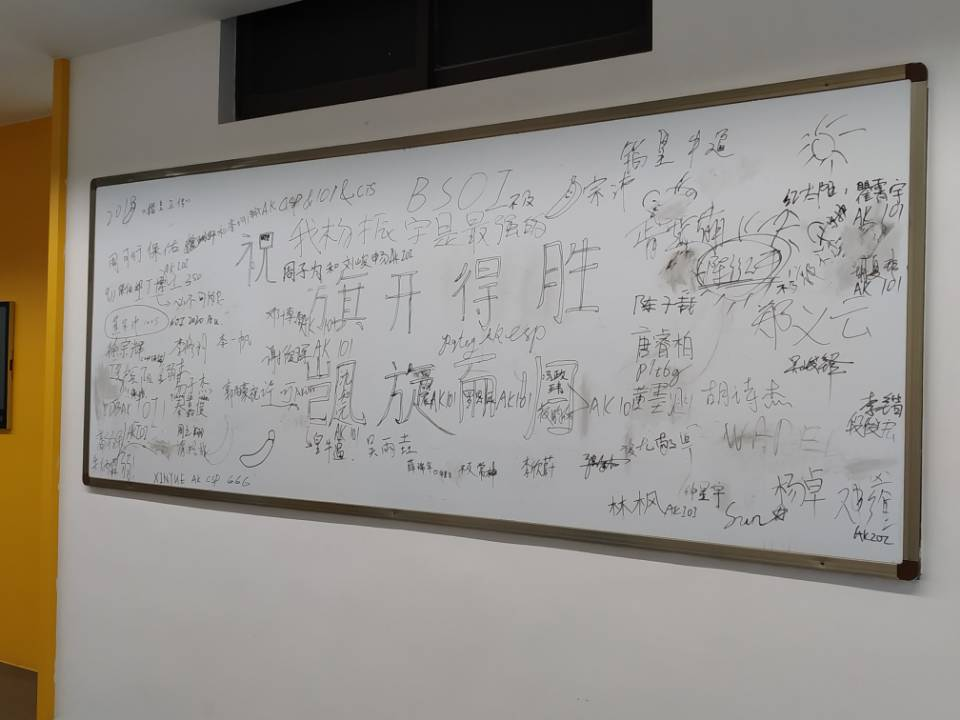

## Day -26

初赛。

感觉比去年水很多啊，出来人均90+的样子，咕分80+的我瑟瑟发抖

所以CSP要比NOIP简单？ ~~flag x1~~

终测貌似比估分高了一点，但复赛线六十几也太离谱了吧？

## Day -12

停课了。

学校给我们年级搞OI的单独腾出来一个机房用，~~卸sb自带软件~~装电脑装了一晚上

似乎被分配到了绝佳摸鱼位？

## Day -9

毒瘤xinyue天天~~省选~~CSP-S模拟

喂喂提高组有这么难吗 ~~flag x2~~

## Day -6

完成成就：第一次线下联机打则

~~机房存在的价值不就在于局域网吗~~

格斗苦手不敢参战太久，大部分时间都在看LF咲夜吊打disangan233（

## Day -4

妖妖梦EX初通！

激动的调到Extra Start发现并没有PH，，，

好像还没有收完60张符卡不能解锁啊

然后继续颓颓颓（

~~跑题了~~

 ~~“游”记~~

## Day -2

考前信心赛。

t1水过马上去开t3然后看错题意，以为是个sb树上差分+倍增题就敲了，然后死活调不过大样例。寻思我过了小样例，不太可能是题意看错了吧，然后就硬钢2h无果，t2 sb换根dp水了个暴力就滚粗了...

机房倒数第一，信心赛成功爆炸 :(

有一个神奇的小插曲，考试的时候班主任（halfway）来给我们CSP-S壮行，一个彪形大汉一脚踹开大门就是一声：“同学们——”，身后是一群同样剽悍的其他竞赛的同学...

~~FBI OPEN THE DOOR~~

~~彩6既视感~~

总之，剽悍的班主任发给我们每人一根士力架和一瓶样式独特的可口可乐，扬长而去...

~~这可乐没啥味道啊跟白水一样~~

## Day -1

怎么你们人人都在制造恐慌啊都在复习些啥啊CSP考FFTNTT吗害人不浅啊你们这些神仙啊啊啊

## Day 0

### 上午

开始还比较正常，然后jzp突然叫我们去帮着把电脑搬到CSP-S的考场去——

蛤？？？

回来气氛就变得沙雕起来，xinyue和jzp让我们到机房外的白板上签名留念

也许有些人后天过后就见不到了，珍惜当下的时光吧...

### 中午

机房变网吧.jpg

### 下午

两点钟坐车去试机。

随便敲了个线段树，居然把PushDown给忘掉了，有被菜到。左顾右盼一波，旁边有神仙10min切了LCT...

害怕.jpg

和吸取教训，p9t6g，Waper去看了初中老师，班主任让我们飞黄腾达了过后回去修理一下他们班现在跳的一批的信竞生？？？

## Day 1

差评，没有发面包（

~~没错我考CSP就是冲着这个来的~~

压缩包密码“认真思考”，分不清O和0输错了好多次

t1瞪了10min切了

t2看上去有点意思，想到了最基础的dp，然后发现要整体移动，但居然没有想出来怎么搞。换个思路想觉得可以只关心在$0$哪里的dp值，这样就可以不用dp，直接从每个点往上跳，把时间复杂度优化到与树高相关。然后又想了想，似乎可以倍增找断点然后主席树或者离线维护一个桶。自己感觉不太稳，就先水50pt去看t3了

t3一股不可做的样子，，看暴力吧

$n!$的10pt肯定能拿吧，链的数据也可以骗吧

开始敲了

诶这链怎么这么难写啊

看了看数据范围突然想到退火，然后就弃掉了链开始敲敲敲

调了好久好久，样例1 $T=1$正确率总是极低..

t3爆0，我怕是没了啊

回去测了t2的链的大样例 ~~114514什么鬼~~ ，发现本地居然只跑了10s，然而好像并不能改变什么...

剩下20min检查文件，安静的坐着~~胡思乱想~~

话说这个t2大样例如此优秀，这个t3这么毒瘤，是不是今年的出题人都很年轻鸭？

出了考场发现人均200+，有点小失落

t1卡ull啊那我5分没了

t2移位直接指针移位回溯复原就可以了啊，真就考场智商减半吗，，，

我们这里的集训队爷好像都没做起t3，这啥神仙题啊

这场的t3倒是让我发现退火并没有想象中的万能，总结了一些不太适合用退火的题型，学到了（

嗯，一股省选气息

不管，继续颓TH（

## Day 2

差评，还是没有发面包（

密码是“抓紧时间”。

看着t1一脸懵，感觉连骗分都有点虚，就开了t2。随便想了个$O(n^3)$的区间划分dp，感觉还可以优化，然后开了t3。40pt的白送$O(n^2)$和15pt的链好像很好骗的样子，就开始写t3——

结果链就给写崩了，调了整整30min...

回头看t2，先写了$O(n^3)$的dp，然后发现决策好像是单调的，单调移动指针维护后缀min即可$O(n^2)$，写了会儿就过了大样例。

又回头看t1，突然发现好像用沙雕五维dp就可以有64pt了，就rush了一波，竟然没怎么调就过了。

还剩20min，估计差不多就这样了。

观察了一下四周，右手边的老哥打开了画图画了只草泥马？？？

三道暴力滚粗。

t1比大众暴力少骗了二十分，t3没打二叉树，爆炸

day2还是挺有区分度的，巨佬们估计考的不错吧

## 赛后

花了20%的钱参加了一场NOI

~~江西花了10%的钱参加了两场NOI~~

听说今年的普及组挺简单的？

赛后的某个星期天 记
