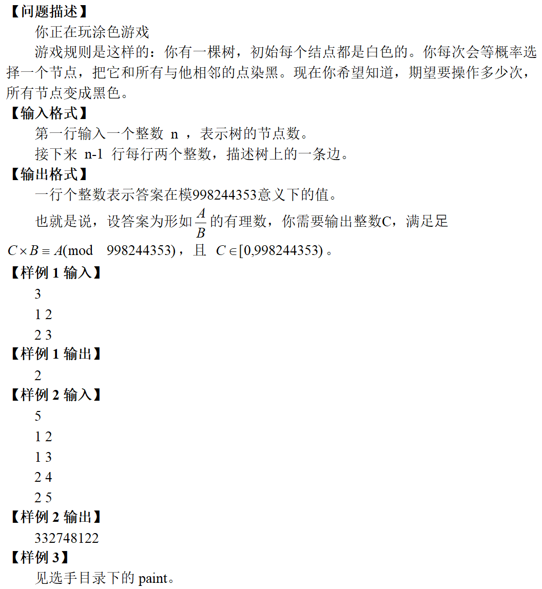

[bsoj6412](https://oj.bashu.com.cn/code/problempage.php?problem_id=6412) 没找到出处。。。

>

题意简述：给一颗树，一次操作定义为随机选择一个点，染掉该点和它周围一圈的点，问期望多少次染黑所有点。

这是道好题啊！全面考察了容斥、反演、期望和dp，有许多值得注意的细节。

## 一、做法1（容斥/二项式反演+dp）{#s-1}

### 1.1 化式子{#s-1.1}

首先肯定第一个想到的式子就是

$$
Ans = \sum_{i=1}^{\infty} i *  P(在染第i次时刚好黑完)
$$

这是根据期望的定义直接得到的。

然后发现这个$i$实在是非常的恶心，因为它居然和无穷有关。但既然是一个合法的期望题，这个$i$必然可以找到某种转化的手段把它弄成一个能算的且收敛的东西，比如等比数列级数之类的。

于是这里有一个套路化法
$$
\sum_{i=1}^{\infty} i *  P(x=i) = \sum_{i=0}^{\infty} P(x>i)
$$

（$P(A)$代表事件$A$发生的概率）

就是改了改枚举的方式，随便想一想应该能够明白了吧（

总之，根据上式我们就可以得到
$$
Ans = \sum_{i=0}^{\infty} P(染i次未黑完)
$$

我们成功把$i$丢到了$P$里面去。但是我们还是没有办法求这个东西。

发现虽然选点可以进行无数次，但是最多只会选有限个点，许多选点是重复的。用实际选择的点的个数，我们可以在不可计算的无限和可计算的有限之间搭上一座桥梁。我们考虑将上面的$P$进行一个拆分，得到
$$
Ans = \sum_{i=0}^{\infty} \sum_{k=0}^{n} P(选i次恰好选中某k个点) * N(k个点未黑完整棵树)
$$

$N(A)$代表事件$A$的方案数

注意式子中“某”的含义。可以这样理解这个式子：

我钦定了某$k$个点

首先我想知道：进行$i$次随机选择，选中且只选中这$k$个点的概率

然后再判断这$k$个点是否能让整棵树黑完。如果不能，则将这部分概率计入。

将所有可能钦定的情况合起来就是$N$，而选择的概率实际上和树形结构无关，选中任意$k$个点的概率都是一样的，所以直接乘起来即可。

好，理解了上式，我们来仔细研究$P$和$N$到底是什么。

### 1.2 容斥/二项式反演{#s-1.2}

首先研究$P$。首先如果恰好选中某$k$个点，那么必然先得保证这$i$次都不能选中其他的点。概率是
$$
(\frac{k}{n})^i
$$

但这样计算显然是有问题的。因为可能出现有点一次都没有被选中的情况，而这不满足我们“恰好选中”的要求。换句话说，我们只能计算$P(|被选中的点| \le p)$。而实际上，我们需要的是 $P(|选中的点集| = p)$。

~~容易~~想到容斥掉它。

考虑枚举一次都没有被选中的点，经过仔细思考，我们能够艰难的得到
$$
P(选i次恰好选中某k个点) = \sum_{p=0}^k C_k^p (-1)^p (\frac{k-p}{n})^i
$$

我无力解释这个式子...各位自己尝试理解一下吧...

把某个点一次都没有被选中画成一个圆圈，用Venn图的形式可能有助于理解。

虽然难以理解...不过好在可以用二项式反演推导。
$$
f(n) = \sum_{k=0}^n C_n^k g(k) \iff g(n) = \sum_{k=0}^n C_n^k (-1)^k f(n-k)
$$

套入本题
$$
g_i(k) = P(选i次恰好选中某k个点)
$$

$$
f_i(k) = (\frac{k}{n})^i
$$

这样就好懂多了，，

不管怎么说，我们终于搞到了$P$表达式，而且这个表达式里$i$是指数！带回原式说不定可以用等比级数干掉它。

### 1.3 回到答案式{#s-1.3}

为方便书写，令$a_k = N(k个点未黑完整棵树)$
$$
\begin{aligned}
Ans &= \sum_{i=0}^{\infty} \sum_{k=0}^{n} a_k \sum_{p=0}^k C_k^p (-1)^p (\frac{k-p}{n})^i \\
    &= \sum_{k=0}^{n} a_k \sum_{p=0}^k C_k^p (-1)^{k-p} \sum_{i=0}^{\infty} (\frac{p}{n})^i \\
\end{aligned}
$$

由于当$|q| < 1$时，有
$$
\begin{aligned}
 \sum_{i=0}^{\infty} q^i &= \lim_{n \to \infty} \frac{q^{n+1}-1}{q-1} \\
 &= \frac{1}{1-q}
 \end{aligned}
$$

故
$$
Ans = \sum_{k=0}^{n} a_k \sum_{p=0}^k C_k^p (-1)^{k-p} \frac{n}{n-p}
$$

（当$k=p=n$时，由于上一步转化要求$|q|<1$，而此时$|q|=1$，会出现级数发散的情况。但发现$a_n$显然一定等于$0$，所以直接不算$k=n$的情况即可）

直接枚举是$O(n^2)$的，现在我们只需要求出每一个$a_k = N(k个点未黑完整棵树)$

### 1.4 树形dp{#s-1.4}

首先可以做一步简单容斥简化问题

$$
N(k个点未黑完整棵树) = C_n^k - N(k个点黑完整棵树)
$$

求$N(k个点黑完整棵树)$，很容易想到树上背包

实际上就是在树上分配选点，也就是一个背包，而方案数背包的实质是卷积，所以就是用树形dp维护卷积合并。

开始写状态。

$f[u][0/1][0/1]$表示只考虑以$u$为根的子树，父亲是否被选择，自己是否被选择的方案数。（可能有更简单的状态表示，但我觉得这种更好想更靠谱）

随便写写就有转移方程了。

$$
f[u][0][0] = f[u][1][0] - \prod_v f[v][0][0]
$$

没有父亲援助，自己也不选，只能靠儿子。儿子节点只需要有一个选就可以养活自己。也就是儿子随便乱选减去儿子一个都不选的情况。
$$
f[u][0][1] = I * \prod_v (f[v][1][0] + f[v][1][1])
$$

自己选了，上下随便。
$$
f[u][1][0] = \prod_v ( f[v][0][0] + f[v][0][1] )
$$

父亲选了，自己不选，下面随便。
$$
f[u][1][1] = f[u][0][1]
$$

自己选了，上下随便。

照着dp即可。
$$
N(k个点黑完整棵树) = f[root][0][0][k]+f[root][0][1][k]
$$

顺着之前倒着带回去行了。

### 1.5 时间复杂度{#s-1.5}

#### 1.5.1 答案式{#s-1.5.1}

显然是$O(n^2)$的。

#### 1.5.2 树形dp{#s-1.5.2}

一次卷积$O(n ^ 2)$，会向上合并$O(n)$次...

诶？这不是$O(n^3)$的吗？

实则不然。

设$sz[u]$为以$u$为根的子树大小。显然可能涉及的卷积长度$len \le sz[u]$

于是考虑每个节点$u$下的所有儿子$v$合并起来的耗时。
$$
\sum_{v_1 \not= v_2} sz[v_1] *sz[v_2] = sz[u]^2 - \sum_v sz[v]^2 \\
$$

后面减去的和式，将抵消掉所有儿子节点产生的时间复杂度！

所以真正的复杂度是$O(n^2)$

~~妙啊~~

这里提供另一道题 [loj6289 花朵](https://loj.ac/problem/6289) ，其部分分解法也是这种方式证明时间复杂度

还要优化的话，可以用NTT来做卷积，还可以用堆来实现从小到大合并减少浪费的时间，类似分治NTT。但都只是常数级优化。

### 1.6 总结{#s-1.6}

爆拆期望得无穷级数，尝试去掉无穷，套路化法将$i$化入$P$。

拆掉$P$在无穷与有限间建立联系，分别处理$P$和$N$。

$P$可容斥得出，带回原式用等比级数干掉无穷的$i$

$N$用树上背包可解，仔细推转移即可

### 1.7 Code{#s-1.7}

```c++
#include<iostream>
#include<cstdio>
#include<cmath>
#include<cstring>
#include<ctime>
#include<cstdlib>
#include<algorithm>
#include<queue>
#include<vector>
#include<map>
#include<set>
typedef long long ll;
using namespace std;

ll Rd(){
	ll ans=0;char c=getchar();
	while(c<'0'||c>'9') c=getchar();
	while(c>='0'&&c<='9') ans=ans*10+c-'0',c=getchar();
	return ans;
}

const ll MOD=998244353;
ll QPow(ll x,ll up){
	x=(x+MOD)%MOD;
	ll ans=1;
	while(up)
		if(up%2==0) x=x*x%MOD,up/=2;
		else ans=ans*x%MOD,up--;
	return ans;
}
ll Inv(ll x){
	return QPow(x,MOD-2);
}

const ll PTN=1005;
ll N;
ll fac[PTN],facInv[PTN];
void FacInit(){
	fac[0]=1;for(ll i=1;i<=N;i++) fac[i]=fac[i-1]*i%MOD;
	facInv[N]=Inv(fac[N]);for(ll i=N-1;i>=1;i--) facInv[i]=facInv[i+1]*(i+1)%MOD;
	facInv[0]=1;
}
ll C(ll n,ll m){
	if(n<m) return 0;
	return fac[n]*facInv[m]%MOD*facInv[n-m]%MOD;
}

struct Edge{
	ll u,v;ll nxt;
}edge[PTN*2];
ll graM,last[PTN];
void GraphInit(){graM=0;for(ll i=0;i<PTN;i++) last[i]=0;}
void AddBscEdge(ll u,ll v){
	edge[++graM]=(Edge){u,v,last[u]};
	last[u]=graM;
}
void AddDbEdge(ll u,ll v){
	AddBscEdge(u,v);AddBscEdge(v,u);
}

class Func{public:
	ll sav[PTN];ll len;
	Func(){}
	Func(ll len){
		this->len=len;
		for(ll i=0;i<=len;i++) sav[i]=0;
	}
	void Resize(ll nwLen){
		for(ll i=len+1;i<=nwLen;i++) sav[i]=0;
		len=nwLen;
	}
	ll& operator [] (ll idx){return sav[idx];}
	/*void Debug(){
		cout<<len<<":";
		for(ll i=0;i<=len;i++) cout<<sav[i]<<",";cout<<endl;
	}*/
};
Func operator + (Func A,Func B){
	Func C(max(A.len,B.len));
	A.Resize(C.len);B.Resize(C.len);
	for(ll i=0;i<=C.len;i++) C[i]=A[i]+B[i]%MOD;
	return C;
}
Func operator - (Func A,Func B){
	Func C(max(A.len,B.len));
	A.Resize(C.len);B.Resize(C.len);
	for(ll i=0;i<=C.len;i++) C[i]=A[i]-B[i]%MOD;
	return C;
}
Func operator * (Func A,Func B){
	Func C(A.len+B.len);
	for(ll i=0;i<=A.len;i++)
		for(ll j=0;j<=B.len;j++)
			C[i+j]=(C[i+j]+A[i]*B[j])%MOD;
	return C;
}
Func I(){
	Func A(1);A[1]=1;return A;
}
Func E(){
	Func A(0);A[0]=1;return A;
}
Func f[PTN][2][2];
void FDFS(ll u,ll father){
	Func s00,s00_01,s10_11;
	s00=s00_01=s10_11=E();
	for(ll i=last[u];i!=0;i=edge[i].nxt){
		ll v=edge[i].v;if(v==father) continue;
		FDFS(v,u);
		s00=s00*f[v][0][0];
		s00_01=s00_01*(f[v][0][0]+f[v][0][1]);
		s10_11=s10_11*(f[v][1][0]+f[v][1][1]);
	}
	f[u][0][0]=s00_01-s00;
	f[u][0][1]=I()*s10_11;
	f[u][1][0]=s00_01;
	f[u][1][1]=I()*s10_11;
}
ll A[PTN];
void Solve(){
	FDFS(1,0);
	for(ll k=0;k<=N;k++) A[k]=(C(N,k)-(f[1][0][0][k]+f[1][0][1][k])%MOD+MOD)%MOD;
	ll Ans=0;
	for(ll k=0;k<N;k++){//注意<N 
		ll t=0;
		for(ll p=0;p<=k;p++){
			ll alpha;
			if((k-p)%2==0) alpha=1;
			else alpha=(-1+MOD)%MOD;
			t=(t+C(k,p)*alpha%MOD*N%MOD*Inv(N-p)%MOD)%MOD;
		}
		t=t*A[k]%MOD;
		Ans=(Ans+t)%MOD;
	}
	cout<<Ans;
}
int main(){
	N=Rd();FacInit();
	GraphInit();
	for(ll i=1;i<N;i++){
		ll u=Rd(),v=Rd();
		AddDbEdge(u,v);
	}
	Solve();
	return 0;
}
```


## 二、做法2（minmax容斥+dp）{#s-2}

### 2.1 minmax容斥{#s-2.1}

minmax容斥标准式：
$$
\max(S) = \sum_{T \subseteq S \\ T \not= \varnothing} (-1)^{|T|-1} \min(T)
$$

由于期望具有线性性，它可以拓展到期望：
$$
E(\max(S)) = \sum_{T \subseteq S \\ T \not= \varnothing} (-1)^{|T|-1} E(\min(T))
$$

然后把这个式子映射到本题中来。（下文把操作了多少次称为“时间”）

$S$就是整棵树。集合中的元素可以看做每一个点第一次被染成黑色的时间，于是$\max(S)$就表示染黑集合$S$中所有点的耗时；$\min(S)$表示至少染黑集合$S$中的某一个点的耗时。

套上期望后：$E(\max(S))$表示染黑集合中所有点的期望耗时，也就是本题所要求的答案；$E(\min(T))$表示至少染黑集合中的某一个点的期望耗时。

捋一下思路，由于期望不满足$E(\max(S)) = \max_{x \in S} E(x)$，无法直接遍历求$\max$。但是因为期望具有线性性，可以借助minmax容斥来达到目的。 （这是一类套路题型）

### 2.2 处理 $E(\min(T))${#s-2.2}

于是思考$E(\min(T))$是否容易求得。容易列出：
$$
E(\min(T)) = \frac{|U_T|}{n} + (1 - \frac{|U_T|}{n})(1 + E(\min(T)))
$$

其中$|U_T|$表示选择后能让$T$中某个节点变黑的点的集合。

解得
$$
E(\min(T)) = \frac{n}{|U_T|}
$$

补充一点，显然$S$、$T$、$U_T$有这样的关系
$$
T \subseteq U_T \subseteq S
$$

将表达式带入原式中
$$
E(\max(S)) = \sum_{T \subseteq S \\ T \not= \varnothing} (-1)^{|T|-1} \frac{n}{|U_T|}
$$

枚举子集是复杂度的瓶颈。不过发现枚举中许多项的$|U_T|$都是相同的，考虑把它单独拿出来枚举。
$$
E(\max(S)) = \sum_{u=1}^n \frac{n}{u} \sum_{T \subseteq S \\ T \not= \varnothing \\ |U_T|=u} (-1)^{|T|-1}
$$

也就是说，现在我们只需快速求得
$$
\sum_{T \subseteq S \\ T \not= \varnothing \\ |U_T|=u} (-1)^{|T|-1}
$$

思考这式子的意义。其实它就是一个带上了容斥系数的所有$T$的方案数之和，也就是$|T|$为奇的方案数减去$|T|$为偶的方案数。

尝试通过树形dp解决

### 2.3 树形dp{#s-2.3}

首先简单考虑一下所需的状态。考虑以某个点为根的子树，我们需要记录$|U_T|$，这是我们上面枚举的基础；$|T|$是容斥系数，我们需要记录它的奇偶性。

可以想到转移大概的形式是在$U_T$上的卷积。

#### 2.3.1 状态压缩{#s-2.3.1}

首先有一个小Trick，可以压掉记录$|T|$奇偶性这一维
$$
\sum_{T \subseteq S \\ T \not= \varnothing \\ |U_T|=u} (-1)^{|T|-1} = - \sum_{T \subseteq S \\ T \not= \varnothing \\ |U_T|=u} (-1)^{|T|}
$$

根据上式，我们在dp时求$|T|$为偶的方案数减去$|T|$为奇的方案数，最后计算答案时乘上个$-1$即可。

这么做的原因是可以压缩掉记录$|T|$奇偶性这一维。

##### 2.3.1.1 对于转移{#s-2.3.1.1}

比如有两个对象$A=(x_1,y_1)$，$B(x_2,y_2)$需要合并为$C$（第1个参数表示$|T|$为偶的方案数，第2个参数表示$|T|$为奇的方案数）
$$
C = (x_1 x_2 + y_1 y_2, x_1 y_2 + x_2 y_1)
$$

如果将对象改写为单个变量记录：$A=x_1 - y_1$，$B = x_2 - y_2$
$$
\begin{aligned}
C &= x_1 x_2 + y_1 y_2 - (x_1 y_2 + x_2 y_1) \\
&= (x_1 - y_1) (x_2 - y_2) \\
&= A B
\end{aligned}
$$

而对象的值就是我们所求的（考虑容斥系数的方案数）。成功压缩。

如果不做上面那一个Trick的转化，压缩状态需要 正\*正=负 和 负\*负=正，而这显然是不成立的。

##### 2.3.1.2 对于新增{#s-2.3.1.2}

如果所有情况的$T$内新增一个节点，原来$|T|$为奇的变为偶，原来为偶的变为奇。

如果不压缩，操作应该是交换$x$和$y$

如果压缩，只需对dp值乘上$-1$即可

#### 2.3.2 设置状态并处理转移{#s-2.3.2}

我们的dp实际上是用背包分配$|U_T|$。

状态压缩后，剩下的主要问题在于合并时$|U_T|$、$|T|$发生的变化对dp值造成的影响，而这变化与当前点$u$到底属于哪个集合密切相关。

由于转移情况复杂，而背包的本质是卷积，所以用封装性良好的卷积实现。

令$f[u][d=0/1/2]$表示仅考虑$S$是$u$为根的子树时，以$x$为下标的列表
$$
\{\sum_{T \subseteq S \\ T \not= \varnothing \\ |U_T|=x \\ u \in Q_d} (-1)^{|T|} \Large | \normalsize \ x \in [0,|S|]\}
$$

$Q_d$是对$u$的限制，具体为

$Q_0$：$u \in S$且$u \not \in U_T$

$Q_1$：$u \in U_T$且$u \not \in T$

$Q_2$：$u \in T$

定义$I$，$I[1]=1$​，其余皆为$0$，结合卷积可以表示向$U_T$内新增一个点。

我们开始处理转移。
$$
f[u][0] = \prod_{v} f[v][0] + f[v][1]
$$

意思是若$u$不在$U_T$里，则它的所有儿子一定不能在$T$里。
$$
f[u][1] = \left( \left( \prod_v f[v][0] + f[v][1] +f[v][2] \right) - f[u][0] \right) * I
$$

若$u$在$U_T$内而$u$不在$T$内，则$u$的儿子中至少有一个是$T$中的点。这可以转化为所有情况的答案减去所有儿子都不在$T$中的答案。最后卷上$I$为$U_T$新增$u$。
$$
f[u][2] = - \left( I * \prod_v \left( f[v][0] * I + f[v][1] + f[v][2] \right) \right)
$$

若$u$在$T$内，那些本来不在$U_T$内的$u$的儿子现在就应该属于$U_T$了。然后既然$u$属于$T$，那么$u$也属于$U_T$，卷上$I$为$U_T$新增$u$。最后，由于$T$新增了个点，也就是说所有项的容斥系数$+1$，整体变号即可。

最后算答案，参考早前化出的答案式即可。

### 2.4 时间复杂度{#s-2.4}

答案式部分显然$O(n)$

树形dp卷积的时间复杂度为$O(n^2)$，见做法1对dp的时间复杂度证明。

### 2.5 总结{#s-2.5}

首先我们发现这道题适用于minmax容斥的套路，于是将难求的$E(max(S))$转化到容易求的$E(min(T))$。

然后我们再想办法优化枚举子集，发现$U_T$是一个关键的变量，于是将其提出来单独枚举，问题转化为求带有容斥系数的方案数。

回头观察题面发现是树状结构，必然有其特殊性质，于是猜想用树形dp解决。讨论合并时$U_T$和$T$是如何变化的，能够列出转移方程式。在中间想到了压缩状态，简化了dp。

### 2.6 Code{#s-2.6}

```c++
#include<iostream>
#include<cstdio>
#include<cstring>
#include<cmath>
#include<ctime>
#include<cstdlib>
#include<algorithm>
#include<queue>
#include<vector>
#include<map>
#include<set>
using namespace std;
typedef long long ll;
ll Rd(){
	ll ans=0;char c=getchar();
	while(c<'0'||c>'9') c=getchar();
	while(c>='0'&&c<='9') ans=ans*10+c-'0',c=getchar();
	return ans;
}

const ll MOD=998244353;
ll QPow(ll x,ll up){
	x=(x+MOD)%MOD;
	ll ans=1;
	while(up)
		if(up%2==0) x=x*x%MOD,up/=2;
		else ans=ans*x%MOD,up--;
	return ans;
}
ll Inv(ll x){
	return QPow(x,MOD-2);
}

const ll PTN=1E3+5;
struct Edge{
	ll u,v;ll nxt;
}edge[PTN*2];
ll N,graM,last[PTN];
void GraphInit(){graM=0;for(ll i=0;i<PTN;i++) last[i]=0;}
void AddBscEdge(ll u,ll v){
	edge[++graM]=(Edge){u,v,last[u]};
	last[u]=graM;
}
void AddDbEdge(ll u,ll v){
	AddBscEdge(u,v);AddBscEdge(v,u);
}

class Func{public:
	ll sav[PTN];
	ll len;
	ll& operator [] (ll idx){return sav[idx];}
	Func(){}
	Func(ll len){
		this->len=len;
		for(ll i=0;i<=len;i++) sav[i]=0;
	}
	void Expand(ll nwLen){
		for(ll i=len+1;i<=nwLen;i++) sav[i]=0;
		len=nwLen;
	}
	Func operator - (){
		Func B;B.len=len;
		for(ll i=0;i<=len;i++) B[i]=(-sav[i]+MOD)%MOD;
		return B;
	}
	/*void Debug(){
		cout<<len<<":";
		for(ll i=0;i<=len;i++) cout<<sav[i]<<',';cout<<endl;
	}*/
};
Func E(){
	Func A(0);A[0]=1;
	return A;
}
Func I(){
	Func A(1);A[1]=1;
	return A;
}
Func operator + (Func A,Func B){
	Func C(max(A.len,B.len));
	A.Expand(C.len);B.Expand(C.len);
	for(ll i=0;i<=C.len;i++) C[i]=(A[i]+B[i])%MOD;
	return C;
}
Func operator - (Func A,Func B){
	Func C(max(A.len,B.len));
	A.Expand(C.len);B.Expand(C.len);
	for(ll i=0;i<=C.len;i++) C[i]=(A[i]-B[i]+MOD)%MOD;
	return C;
}
Func operator * (Func A,Func B){
	Func C(A.len+B.len);
	for(ll i=0;i<=A.len;i++)
		for(ll j=0;j<=B.len;j++)
			C[i+j]=(C[i+j]+A[i]*B[j])%MOD;
	return C;
}

Func f[PTN][3];
void DFS(ll u,ll fa){
	f[u][0]=f[u][1]=f[u][2]=E();
	for(ll i=last[u];i!=0;i=edge[i].nxt){
		ll v=edge[i].v;if(v==fa) continue;
		DFS(v,u);
		f[u][0]=f[u][0]*(f[v][0]	+f[v][1]);
		f[u][1]=f[u][1]*(f[v][0]	+f[v][1]+f[v][2]);
		f[u][2]=f[u][2]*(f[v][0]*I()+f[v][1]+f[v][2]);
	}
	f[u][1]=(f[u][1]-f[u][0])*I();
	f[u][2]=-(f[u][2]*I());
}
void Solve(){
	DFS(1,0);
	ll Ans=0;
	for(ll i=1;i<=N;i++){//注意从1开始，因为minmax容斥不包含空集 
		Ans=(Ans+N*Inv(i)%MOD*(f[1][0][i]+f[1][1][i]+f[1][2][i]))%MOD;
	}
	cout<<(-Ans+MOD)%MOD;
}
int main(){
	N=Rd();
	GraphInit();
	for(ll i=1;i<N;i++){
		ll u=Rd(),v=Rd();
		AddDbEdge(u,v);
	}
	Solve();
	return 0;
}
```

## 三、总结{#s-3}

这道题简直人类智慧（

解题思路很具有参考价值，实为一道期望好题！

上周末看到这道题，因为全网都找不到出处也没题解，硬是对着一张题解截图（解法1）和先比我写出来的Waper爷的代码（解法2）杠出来了

我现在感觉我整个人都升华了.jpg
