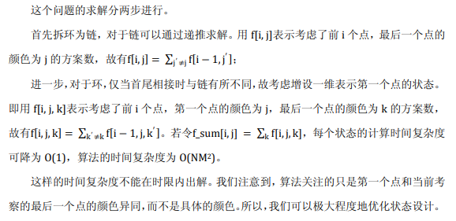

## 经典

我们先来解决最经典的圆环染色问题。

>一个环上有$n$个点，每个点染为$m$种颜色之一，要求相邻两点颜色不同。求可行的方案数。

这里有一道题的部分分是这个问题：[uoj#241. 【UR #16】破坏发射台](http://uoj.ac/problem/241)



那么，设$f[i][0/1]$表示当前正在决定第$i$位的颜色，且要求该颜色是否（$0/1$）与第$1$位颜色相同。

对于$f[i][1]$没啥好决定的，第$i$位必须与第$1$位相同，所以系数是$1$。

对于$f[i][0]$分两种情况，一种前接$f[i-1][1]$，这时第$i-1$位颜色与第$1$位颜色相同，有$(m-1)$种颜色供第$i$位选择。一种是前接$f[i-1][0]$，第$i-1$位与第$i$位不同了，第$i$位不能与其中任一相同，只有$(m-2)$种可以选。
$$
\begin{aligned}
f[i][0] &= (m-2) f[i-1][0] + (m-1) f[i-1][1] \\
f[i][1] &= f[i-1][0]
\end{aligned}
$$

初始状态很重要，保险的定义应该从$2$开始，但是根据意义从$1$开始也无妨。

```c++
#include<iostream>
#include<cstdio>
#include<cmath>
using namespace std;
typedef long long ll;
const ll MOD=998244353;

const ll MXN=1E7+5;
ll f[MXN][2];
int main(){
	ll N,M;scanf("%lld%lld",&N,&M);
	f[1][0]=0,f[1][1]=M;
	for(ll i=2;i<=N;i++){
		f[i][0]=((M-1)*f[i-1][1]+(M-2)*f[i-1][0])%MOD;
		f[i][1]=f[i-1][0]%MOD;
	}
	cout<<f[N][0];
	return 0;
}
```

上面这个dp其实还可以更优，用矩阵快速幂可以优化，也可以用特征根等方式推出通项公式$(m-1)^n+(m-1)(-1)^n$。

下面介绍几种变种，本质其实是一样的，可以根据题目灵活选择。

可以考虑钦定第$1$位的颜色，把枚举第$1$位颜色放在求答案部分。

可以考虑假设出一个第$0$位的颜色，这样环的要求变为第$0$为与末位相同，即答案变为$f[n][1]$。好处在于可以将初始状态提前到第$0$位设置。

还有另一种dp的方式是钦定当前位的颜色，考虑前一位可以选那些颜色。状态转移方程是：
$$
\begin{aligned}
f[i][0] &= f[i-1][1] + (m-2) * f[i-1][0] \\
f[i][1] &= (m-1) * f[i-1][0]
\end{aligned}
$$

既然是钦定，答案就需要另外乘$M$来枚举颜色。

总之，都是拆环为链，压缩无用状态，用一个$0/1$位保留环的限制。

我们从中获取了一种处理这类环上dp的思路，即**增设0/1位来维护首尾信息**


利用该模型，可以解决许多变种问题。

## 破坏发射台

[uoj#241. 【UR #16】破坏发射台](http://uoj.ac/problem/241)

>一句话题意：长度为 $n$ 的环，每个点染色，有 $m$ 种颜色，要求相邻相对不能同色，求方案数对 $998244353$ 取模的结果。（定义两个点相对为去掉这两个点后环能被分成相同大小的两段）
>
>$n,m \le 10^9$

[官方题解 UOJ Round #16](http://c-sunshine.blog.uoj.ac/blog/2026)

对于长度为奇数的环，就是经典问题，矩阵快速幂或者直接通项公式即可。

对于长度为偶数的环，就有点复杂了。因为要考虑相对点之间的相互影响，不妨将它们捆在一块，装在一个状态里考虑。然后，我们需要处理环的上半部分和下半部分的相互接触问题，类比处理经典问题的思路，

>我们设第一格的颜色为 $A$，设第 $n/2+1$ 格的颜色为 B，然后设个二元三进制状态表示第 i 格和第 $n/2+i$ 格的颜色是否为颜色 A 或颜色 B（$1≤i≤n/2$）。
>
>设 $F[i][0..8]$ 表示推到第 $i$ 格的所有二元三进制状态的合法方案数，然后递推一波即可。
>
><p style="text-align: right">——UOJ Round #16 题解</p>

这个讨论有点变态，，，代码就咕了（

## 彩色圆环

[清橙A1202](http://www.tsinsen.com/A1202) [bzoj2201](https://www.lydsy.com/JudgeOnline/problem.php?id=2201) [bsoj4074](https://oj.bashu.com.cn/code/problempage.php?problem_id=4074)

>### 试题来源
>
>2010中国国家集训队命题答辩
>
>### 问题描述
>
>小A喜欢收集宝物。一天他得到了一个圆环，圆环上有N颗彩色宝石，闪闪发光。小A很爱惜这个圆环，天天把它带在身边。
>
>一天，小A突然发现圆环上宝石的颜色是会变化的。他十分惊讶，仔细观察这个圆环后发现，圆环上宝石的颜色每天变化一次，而且每颗宝石的颜色都等概率地为特定的M种颜色之一。小A发现了这个秘密后，对圆环更是爱不释手，时时刻刻都在研究。
>
>又经过了一段时间，小A发现因为圆环上宝石的颜色不断变化，圆环有时会显得比其他时候更美丽。为了方便比较，小A这样定义圆环的“美观程度”：
>
>设圆环上相同颜色的宝石构成的连续段长度分别为a1, a2, ..., an；
>
>定义圆环的“美观程度” $R = \prod_{i=1}^{n} a_i$​ 。以图一给出的圆环为例，有a1 = 3, a2 = 2, a3 = 1，故R = 6。
>
>现在小A想知道，在上述前提下，圆环的“美观程度”的期望值E(R)是多少。因为如果知道了E(R)，他就可以判断每天变化出的新圆环是否比一般情况更美丽。
>
>说明：“美观程度”的期望值即为对每种可能的圆环状态的“美观程度”与其出现概率的乘积进行求和所得的值。
>
>### 输入格式
>
>输入仅有一行，该行给出依次两个正整数N, M，分别表示宝石的个数和宝石在变化时可能变成的颜色种类数。
>
>### 输出格式
>
>输出应仅有一行，该行给出一个实数E(R)，表示圆环的“美观程度”的期望值。
>
>### 样例输入
>
>3 2
>
>### 样例输出
>
>2.25
>
>### 样例输入
>
>200 1
>
>### 样例输出
>
>200
>
>### 数据规模和约定
>
>20%的数据满足1 ≤ N, M ≤ 8；
>
>50%的数据满足1 ≤ N, M ≤ 25；
>
>100%的数据满足1 ≤ N ≤ 200, 1 ≤ M ≤10^9。

先来看链的情况

设$f[i]$表示考虑到第$i$位时的期望美观度，按划分颜色块的思路dp，显然有
$$
f[i]=\sum_{0 \le j < i} f[j]*(i-j)*P[i-j]*(M-1)
$$

其中$P[i]$表示连续选$i$个相同一种颜色的概率
$$
P[i] = M^{-i}\\
$$

$(M-1)$代表当前颜色块的颜色要与前块不同

那么现在用圆环染色的思路来试着写环的dp式

正如解决原始版本的方式，我们拆环为链，并假设已经钦定了第$0$位的颜色。我们设$f[i][0/1]$表示考虑前$i$位，且要求第$i$位（所属块）颜色是否（$0/1$）与第$0$位颜色相同，这时的期望美观度。可得转移方程：
$$
f[i][0] = \sum_{0 \le j < i} f[j][0]*(i-j)*P[i-j]*(m-2) + f[j][1]*(i-j)*P[i-j]*(m-1)\\
f[i][1] = \sum_{0 \le j < i} f[j][0]*(i-j)*P[i-j]
$$

考虑如何求答案。由于无法直接获取首尾相接颜色块长度，考虑将它单独拎出来计算。枚举首尾相接颜色块两端加起来的总长度$x$，则总共有$x$种分割首尾的方案，每种方案有$M$个颜色可以选择（因为钦定），每个方案贡献为$x$，剩下的部分就可以用$f$来表示了。（想想钦定第$0$位而不是第$1$位的目的）

$x=N$时要特判，于是答案如下
$$
Ans = P[N]*N*M + \sum_{1 \le x < N} x*x*P[x]*M*f[n-x][0]
$$

$O(n^2)$的代码

```c++
#include<iostream>
#include<cstdio>
#include<cmath>
#include<cstring>
#include<ctime>
#include<cstdlib>
#include<queue>
#include<vector>
using namespace std;
typedef long double ldb;
typedef long long ll;

const ll MXN=1005;
ll N,M;
ldb f[MXN][2];
ldb P[MXN];
int main(){
	cin>>N>>M;
	P[0]=1;for(ll i=1;i<=N;i++) P[i]=P[i-1]/M;
	f[0][0]=0;f[0][1]=1;//f[0]时只有第0位，一定相同，故f[0][0]不合法置0，f[0][1]置单位元
	for(ll i=1;i<=N;i++){
		f[i][0]=f[i][1]=0;
		for(ll j=0;j<i;j++){//可以从0转移，给了只有一个块转移的机会
			f[i][0]+=f[j][0]*(i-j)*P[i-j]*(M-2)
					+f[j][1]*(i-j)*P[i-j]*(M-1);
			f[i][1]+=f[j][0]*(i-j)*P[i-j];
		}
	}
	ldb ans=N*P[N]*M;
	for(ll x=1;x<N;x++)
		ans+=x*x*P[x]*M*f[N-x][0];//一个x是贡献，一个x是分割开头和结尾的方式数，f[N-x][0]则充当了中间部分 
	printf("%.5Lf",ans);
	return 0;
}
```

我们发现推出的dp方程有一部分是与$j$无关的。将它们提出来，维护剩下的只与$j$有关的前缀和，复杂度即可降至$O(N)$

前缀和优化后$O(n)$

```c++
#include<iostream>
#include<cstdio>
#include<cmath>
#include<cstring>
#include<ctime>
#include<cstdlib>
#include<queue>
#include<vector>
using namespace std;
typedef long double ldb;
typedef long long ll;

const ll MXN=1000005;
ll N,M;
ldb f[MXN][2];
ldb powM[MXN];//M^i
int main(){
	cin>>N>>M;
	powM[0]=1;for(ll i=1;i<=N;i++) powM[i]=powM[i-1]*M;
	
	f[0][0]=0;f[0][1]=1;
	ldb s_01=0,s_0j=0;
	ldb s_11=1,s_1j=0;
	for(ll i=1;i<=N;i++){
		f[i][0] = s_01*(M-2)*i/powM[i] + s_0j*(M-2)/powM[i]
				+ s_11*(M-1)*i/powM[i] + s_1j*(M-1)/powM[i];
		f[i][1] = s_01		*i/powM[i] + s_0j      /powM[i];
		
		s_01 += f[i][0]*powM[i];
		s_0j += f[i][0]*powM[i]*i;
		s_11 += f[i][1]*powM[i];
		s_1j += f[i][1]*powM[i]*i;
	}
	ldb ans=N/powM[N]*M;
	for(ll x=1;x<N;x++)
		ans+=x*x/powM[x]*M*f[N-x][0];
	printf("%.5Lf",ans);
	return 0;
}
```

实际上是会炸精度的，懒得管了:p
