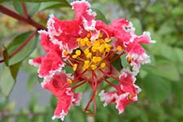
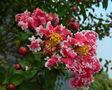

## Problem

近日，由国家花卉工程技术研究中心与北京林业大学紫薇课题组培育的紫薇新品种“灵梦”通过现场审定。“灵梦”由 Dallas Red 与 Velma's Royal Delight 两个紫薇品种的杂交后代选育得到，为直立株型，开复色花，红色为底、白色镶边。 现某研究小组对“紫薇”【注】的花色遗传展开研究。



研究小组选取红色纯合“紫薇”与白色纯合“紫薇”作为亲本杂交，$F_1$ 全为粉红色“紫薇”。令 $F_1$ 自交，$F_2$ 各表现型比例如表所示。

| 红色 | 粉红色 | 红底白边 | 粉红底白边 | 白色 |
| ---- | ------ | -------- | ---------- | ---- |
| 3    | 6      | 1        | 2          | 4    |

已知“紫薇”的花色由两对独立遗传的等位基因（$\mathrm{A}$ 与 $\mathrm{a}$、$\mathrm{B}$ 与 $\mathrm{b}$）控制，其中 $\mathrm{A}$ 与 $\mathrm{a}$ 控制“紫薇”的底色。

1. “紫薇”花色遗传满足 `________` 定律， `______________` （填细胞周期阶段）体现了这一定律（不考虑交叉互换）。
2.  已知一种白色“紫薇”基因型为 $\mathrm{aabb}$，现将该“紫薇”与 $F_2$​ 粉红底白边“紫薇”杂交，子代表现型有 `____` 种。
3. 实验中亲本基因型分别为 `______________` ；$F_2$ 所有表现型中性状可以稳定遗传的有 `______________` ；$F_2$ 白色“紫薇”中纯合子与杂合子的比例为 `______` 。
4. 研究小组尝试让 $F_2$ 所有粉红色“紫薇”自由交配，得到类似“灵梦”的红底白边“紫薇”。推测红底白边“紫薇”在子代中的占比为 `____` 。

【注】紫薇的遗传多样性非常丰富，题目中“紫薇”的花色遗传方式纯属虚构，还请周知。

## Answer

```
(1) 自由组合 第一次减数分裂后期
(2) 2
(3) AABB和aabb 红底白边“紫薇”和白色“紫薇” 1:1
(4) 1/36
```

## Solution

1. 问送分。

   由 `红色纯合“紫薇”与白色纯合“紫薇”作为亲本杂交， F_1 全为粉红色“紫薇”`，又由 `A 与 a 控制“紫薇”的底色`，可以判断 $\mathrm{Aa}$ 表现为粉红色，而 $\mathrm{AA}$ 或 $\mathrm{aa}$ 表现为红色或白色。

   观察 $F_2$​ 表现型比例，初步发现其具有典型 $\mathrm{AaBb}$ 性状分离的特征，于是可以断定 $F_1$​ 粉红色“紫薇”的基因型为 $\mathrm{AaBb}$。

   现尝试解释比例。因为 $\mathrm{A}$​​​ 与 $\mathrm{a}$​​​ 控制的花色性状与是否杂合有关，故容易想到按“$\mathrm{A}$​​​ 与 $\mathrm{a}$​​ 是否杂合”的标准拆分 $9:3:3:1$​，得到 $(3+6):(1+2):3:1$​，几乎拿到 $F_2$​ 的性状比。推测 $F_2$​​​​​​ 白色“紫薇”比例 $4 = 3+1 = \mathrm{aaB?} + \mathrm{aabb}$，而根据 2 问题干 `已知一种白色“紫薇”基因型为 aabb` 也确认了该推测。进一步对照表格即可得到题眼：

   + $\mathrm{AA}$ 表现为红色，$\mathrm{Aa}$ 表现为粉红色，$\mathrm{aa}$ 表现为白色；
   + $\mathrm{B?}$ 表现为纯色，$\mathrm{bb}$ 表现为有白边；
   + 无法区分白色和“白底白边”。

2. 问，粉红底白边“紫薇”的基因型为 $\mathrm{Aabb}$，与 $\mathrm{aabb}$ 测交得到粉红底白边 $(\mathrm{Aabb})$、白色 $(\mathrm{aabb})$ 两种后代。

3. 问，亲本基因型分别为 $\mathrm{AABB}$​ 和 $\mathrm{aabb}$​； $F_2$​ 红色 $(\mathrm{AABB}$​, $\mathrm{AABb})$​、粉红色 $(\mathrm{AaBB}, \mathrm{AaBb})$​、粉红底白边 $\mathrm{(Aabb)}$​ 均可能发生性状分离，而红底白边 $\mathrm{(AAbb)}$​ 和白色 $\mathrm{(aaBB, aaBb, aabb)}$​ 可以稳定遗传；根据性状分离比，$F_2$​ 白色“紫薇”的基因型构成为 $\mathrm{aaBB}:\mathrm{aaBb}:\mathrm{aabb}=1:2:1$​，易得纯杂比为 $1:1$​。

4. 问，$F_2$​​​ 粉红色“紫薇” $( \frac{1}{3} \mathrm{AaBB}, \frac{2}{3} \mathrm{AaBb})$​​ 自由交配，要求得到红底白边“紫薇” $(\mathrm{AAbb})$​​。单独考虑每对基因。对 $\mathrm{A}$​​ 与 $\mathrm{a}$​​，根据性状分离比，红底概率为 $\frac{1}{4}$​​ 。对 $\mathrm{B}$​​ 与 $\mathrm{b}$​​，使用配子法，得 $( \frac{2}{3} \mathrm{B}, \frac{1}{3} \mathrm{b})$，于是白边概率为 $\frac{1}{3} \times \frac{1}{3} = \frac{1}{9}$ ，综上得到红底白边“紫薇”的概率为 $\frac{1}{4} \times \frac{1}{9} = \frac{1}{36}$​ 。