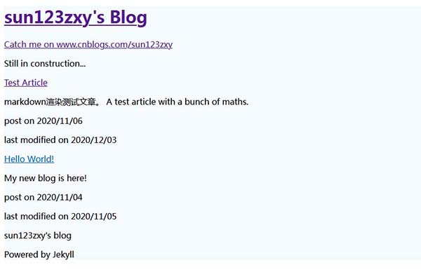
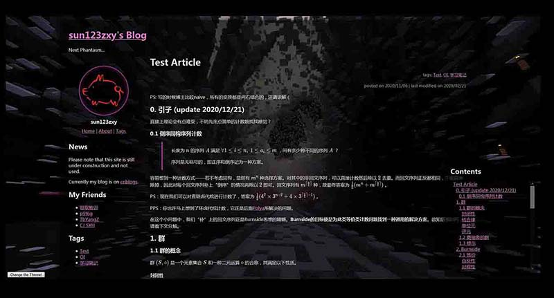
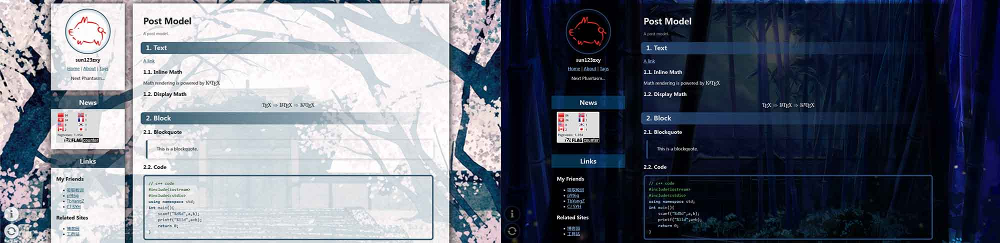
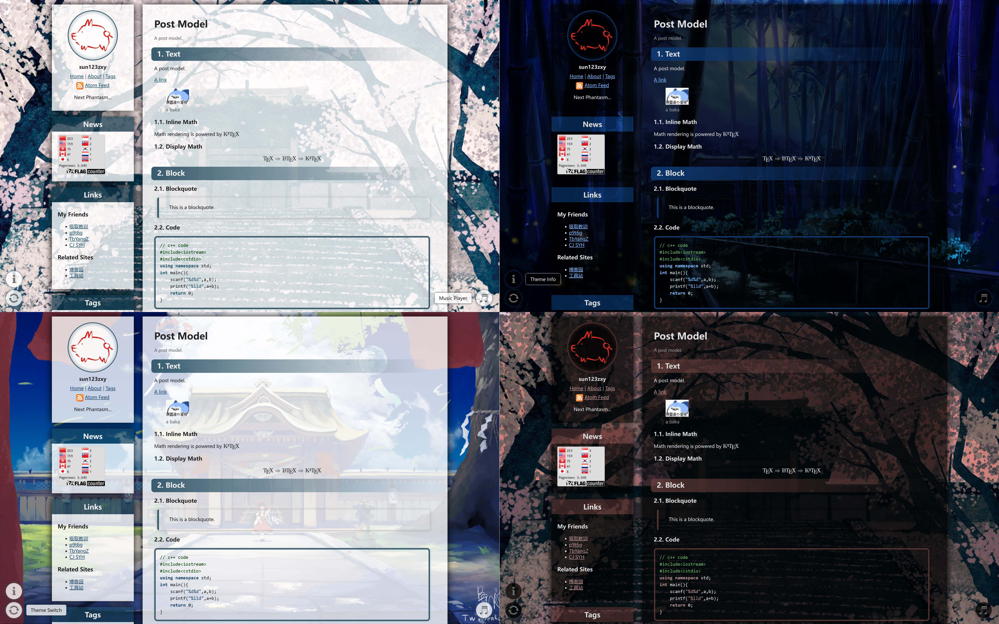

## 旅程开始

很早就在考虑自建博客的事情了。

大概是 18 年吧，根据 OIer 传统，打算开个博客存点模板和学习笔记。博客园广告少，dalao 多，还能自定义 css/js 美化博客，~~比隔壁 CSDN 不知道高到哪里去了~~，虽然不是很懂前端，但一看就来劲了，开始折腾。于是一个暑假 OI 没啥进步，倒是写了一车 css/js 修改自带皮肤，整出来一套多主题切换系统。之后又经过了数次大改重构，适配了 markdown 编辑器，功能日趋完善。

然而改版越来越多，代码越来越乱，寄人篱下也总有这样那样的不方便之处。想来想去，改别人的东西总是有极限的，与其无数次推倒重构，还不如自己去搭个新的。

这么想着又咕了几个月（笑）

直到 20 年晚些时候才开始认真思考这个问题。一开始也是打算在 Hexo 或 Jekyll 上直接套个主题改改就好，毕竟是相当省事。只是某天在机房摸鱼学了波 Jekyll 后，突然一想——折腾博客也两三年了，懂的前端也不少了，又打算自己搭博客，要不干脆从零手撸个出来？

于是又摸了大半年，差不多可以用了。

以前用 markdown 写的文章都搬过来了，其他的回头再说吧。~~好像也没啥保留价值~~

那么，之后就在这边安家了。博客园那边应该还会同步发布，但后续的更新和修改就不能保证了。

还有，话说正式启用博客的时间正好是 8 月 17 日，这个时间...

~~是妖妖梦、风神录正式版发售时间~~

~~给国家省点子弹吧（~~

## 杂谈

聊聊搭建过程中的一点心得。

[博客源码](https://github.com/sun123zxy/blog-jekyll-code)

### 技术 & 功能

+ 基于 [Jekyll](https://jekyllrb.com/) 和 [jekyll-pandoc](https://github.com/mfenner/jekyll-pandoc) 插件，配合自制小工具 [InlineMathSpaceKiller](https://github.com/sun123zxy/InlineMathSpaceKiller) 的静态 markdown 博客。
+ 全站 js 和主题切换动画效果使用 [JQuery](https://jquery.com/)。
+ 支持锚点跳转的目录系统。
+ 数学公式使用 [KaTeX](https://katex.org/) 渲染。
+ 代码高亮使用 [highlight.js](https://highlightjs.org/) 分析代码结构，配合魔改后的样式表实现。
+ 评论系统使用 [Giscus](https://github.com/giscus/giscus)，基于 Github Discussions 的静态博客评论系统。

### 环境配置

看仓库的 `README.md` 吧，Jekyll 的官方文档也可以（其实是我有点忘了 :p）

### 数学公式、jekyll-pandoc 和 InlineMathSpaceKiller

~~用插件干啥啊好好用原生 Jekyll Github 自动帮你编译它不香吗~~

~~本地我用 Typora 编写 markdown~~（最近 Typora 转付费了，现在用 MarkText），希望能在上传过程中尽可能少地改动源文件，这包括内嵌的 $\LaTeX$ 数学公式。但 Jekyll 自带的 markdown 解析器老是不好使，比如公式里的 `|` 被解析成表格了之类各种怪七怪八的问题...

于是想到了文档转换界的瑞士军刀——

> If you need to convert files from one markup format into another, pandoc is your swiss-army knife.

Google 了一圈找到了 [jekyll-pandoc](https://github.com/mfenner/jekyll-pandoc)，可以改用 [Pandoc](https://www.pandoc.org/) 的文档解析来渲染 Markdown。

#### jekyll-pandoc 的具体参数配置

安装流程照着 README 里给的方法走就好了。这里主要谈一谈参数的配置。

jekyll-pandoc 文档里对 `_config.yml` 里面的参数设置给出了一个例子（已经过时了）——

> Additional pandoc options can be provided in the Jekyll `_config.yml`:
> 
> ```yaml
> pandoc:
>  extensions:
>    - normalize
>    - smart
>    - mathjax
>    - csl: _styles/apa.csl
>    - bibliography: bibliography/references.bib
> ```

这些参数等价于 Pandoc 的命令行参数，即上述代码等价于文件渲染时执行

```bash
pandoc target.md -o target.html --normalize --smart --mathjax --csl=_styles/apa.csl --bibliography=bibliography/references.bib
```

所以根据需求照着配就可以了。目前我用的配置是

```yaml
plugins:
   - jekyll-pandoc
markdown: Pandoc
pandoc:
  extensions:
    - mathjax
    - no-highlight
    - from: markdown-smart # disable smart quotes
```

- 开启 `--mathjax` 可以自动把 `$` 和 `$$` 换成 `\(`、`\)` 和 `\[`、`\]`，可以直接被 KaTeX 提供的 `auto-render.min.js` 识别。

- `--no-highlight` 打算用 highlight.js 来做高亮，所以这里就不需要了。

- Pandoc 在转换 Markdown 时默认开启智能标点功能（参见 [Pandoc 文档 - Extensions - Typography](https://pandoc.org/MANUAL.html#typography)），会把 `""`、`''` 自动替换成 `“”`、`‘’`，所以用 `-smart` 关闭这个插件。

#### SpaceKiller

还有一个小问题——Typora （MarkText 好像有这个问题）允许存在形如 `$ \gcd(a,b) $` 这样 `$` 旁边紧跟着空格的行内公式，但 Pandoc 解析不了。后来翻到这个 [issue](https://github.com/jgm/pandoc/issues/5672)，官方似乎不打算修复这个问题，就写了个预处理工具删空格，新文章上传前 `spacekiller` 一下就可以了。

### 文章存储结构

没有使用 Jekyll 自带的 posts。

我不喜欢这种图文分离的组织格式。文本和图片本来就同属一篇文章，强行把图片拆开放到 `/assets/images/.../` 里面既不合逻辑，又丧失了可移植性，匪夷所思。

最后使用了打开 output 选项的 collection 来实现，每篇文章都有一个独立的文件夹，包含 `index.md` （文本）和所需图片、文件等所有内容。`index.md` 里面直接使用相对引用插入图片，和无博客状态下写作体验完全一致。

### 页面设计

白模写好后就开肝 css，一开始完全参考之前魔改的博客园 iMetro 主题整出来个高仿，后来有了一些更好的想法，比如把侧边栏做成 panel 样式之类的，就成现在这个样子了。

### 图片预加载与缓存

国内访问 github.io 很不稳定，背景图片加载特别慢，这几天在想怎么优化这个问题。

最终的方案是在切换主题时等背景图片加载完毕后再向页面引入主题 css 文件。这样在图片加载过程中，页面显示的 css 尚处于无主题的默认状态，避免了背景白屏的现象出现。

于是去学了波预加载技术，最开始用 Ajax 来做，结果写完发现 Firefox 和 Chrome 都好像没看到 Ajax 的缓存一样，又在加载主题 css 时重新请求了一次图片...

无奈，改用 `new Image()` 来预加载。这回 Firefox 好使了，但 Chrome 还是很顽固。想了想，这玩意居然与浏览器有关，是不是因为不同浏览器默认缓存过期时间不一样导致的呢？于是去看了响应头，终于发现原来是测试时 `jekyll serve` 出来的服务器根本没有设置响应的 `Expires`，然后某些浏览器就默认重新加载了...

那刚刚 Ajax 怕不是也是这个原因...

看了一下 github.io 的响应头，有 10min 的 `Expires`，应该部署上去就没问题了。

其实就是个 HTTP Cache 的问题吧，看来理解还不够深刻...

PS：Chrome 或 Firefox DevTool 的节流（throttling）功能可以方便的模拟真实网络的限速和延迟，本地测试时非常方便。

### 背景的视差（Parallax）效果

这个效果很早就做出来了，但现在才开始深入了解。

用 js 监听 `scroll` 事件动态更新背景图片的 `background-position`，以前只有 Firefox 可以实现平滑的滚动，而 Chrome 则会在滚动时白屏——这个问题在最近的版本才消失——总之，当时偷懒，把 Chrome 的这个效果给关了。~~所以根本没人发现有这个效果对吧~~

监听 `scroll` 确实不是个好方法。Firefox 的 Console 在该效果启用时会弹出警告，文档里说会与异步平移有冲突：

- [Scroll-linked effects &mdash; Firefox Source Docs documentation](https://firefox-source-docs.mozilla.org/performance/scroll-linked_effects.html)

- [Asynchronous scrolling in Firefox - staktrace.com](https://staktrace.com/spout/entry.php?id=834)

——异步平移冲突的情况我没碰到，但不论是 Firefox 和 Chrome 偶尔都会白屏倒是真的。第二篇文章里提到一种纯 CSS 实现 Parallax 的方法，网上也有人说可以用 CSS 3D。

以后再研究吧...

### 评论系统

静态博客的评论要托管，之前感觉有点麻烦就没搞。后来想用基于 Github Issue 的现成轮子来做，但是不论是 [Gitalk](https://github.com/gitalk/gitalk) 还是 [Gitment](https://github.com/imsun/gitment) 都得把 OAuth 的 Client Secret 写在前端，太不安全；后来发现有个叫 [Utterances](https://github.com/utterance/utterances) 的基于 Github Apps 的小众项目好像还行，然后就咕咕咕了半年（

再后来就发现了 [Giscus](https://github.com/giscus/giscus)，同样是基于 Github Apps，但和 Utterances 的不同之处在于其使用 Discussions 而不是 Issues 来存储数据。个人认为 Discussions 的设计更适合拿来做评论，总之就花了一个晚上实装了。

但是适配动态切换的主题成了大麻烦。后来找到 [Issue #336](https://github.com/giscus/giscus/issues/336) 发现可以向 iframe 里 `postMessage` 改变参数。但需要注意的是 `postMessage` 之前需先保证 iframe 加载完毕，试图用`onload` 事件，但测试发现开新界面时还是有概率失败。然后又 Google 了一波发现正确的做法似乎是 iframe 自己发消息表明可以接受 `postMessage`，于是就修好了。

## 画廊

（最早的版本没截图找不到了）










## 尾声

当年的 sun123zxy 还真是对多主题系统有着莫名的执念。最开始的他只是想给博客换个背景，现在似乎已经走的很远了。

博客上线后的 sun123zxy 迎来了充实的高三生活，学业紧张的他却从没有忘记劳逸结合，不停的做着小修小补，甚至在高考倒计时两只手就能数过来的时候他还在……

```default
commit 7a2791ebdcc91415982add697a5b40c62044dabc
Author: sun123zxy <304244450@qq.com>
Date:   Wed Jun 1 16:23:16 2022 +0800

    update article

commit edc1e5a0c76f91f0e2ee8bd952550b10f53b3b3f
Author: sun123zxy <304244450@qq.com>
Date:   Wed Jun 1 12:09:19 2022 +0800

    optimize punctuation, update article
```

总之，到此为止，这位不务正业的 OIer 以自己满意的方式结束了高中生活。等待他和他博客的未来，又是怎样的呢？

[博客搭建随想 Part II - Academic Writing's not All About PDF](/posts/20221226-quarto-fantasia/)