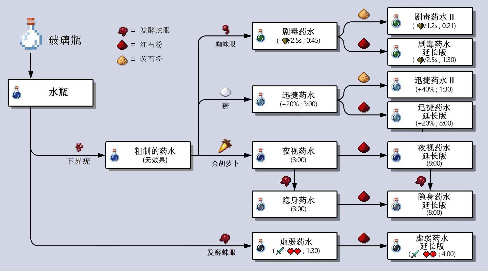

## Problem

“夜视药水”常用于治疗误食夜雀所致的夜盲症。Steve 领导的研究小组正在探究 Minecraft Java Edition 1.13+ 夜视药水的各项理化“特性”。

 

（图1: 部分药水酿造系统）（图2：某品牌“下界疣”粉的包装袋）

1. 小酌怡情，大饮伤身。为提高团队工作效率，Steve 称取 1g “下界疣”粉置于 50mL 玻璃瓶中，加入 10mL 蒸馏水，用玻璃棒搅拌均匀，静置 1h 后得到糊状“粗制的药水”。向“粗制的药水”中加入葡萄糖并在 20 摄氏度环境中培养数天，得到速度加成为 20% 的“迅捷药水”。使用酸性重铬酸钾溶液对产品进行检测，发现溶液由橙色变为灰绿色，由此推断“下界疣”粉中主要微生物的代谢类型为 `______________`。制备“粗制的药水”的实验过程也被称为 `__________`。组装仪器时，Steve 在玻璃瓶上额外加装一段长而弯曲的胶管，其目的是 `__________________`。
2. $\beta$​​​​​ - 胡萝卜素是“夜视药水”的主要有效成分，推测“夜视药水”治疗夜盲症的原理可能为 `____________________________`。“金胡萝卜”富含天然胡萝卜素，成本低廉，不仅是各大工业 MOD 中制取“夜视药水”的主要原料，也是代替“金苹果”治疗僵尸村民的不二之选。在最新研究中，小组成员向虚弱的僵尸村民喂食“金胡萝卜”，一段时间后取其细胞检测，发现癌胚抗原和甲胎蛋白的表达量明显减少，这说明“金胡萝卜”具有 `______________________` 的作用。
3. 小组成员 Alex 在《探究“红石粉”对“夜视药水”作用时间的影响》的实验中，错将“蜘蛛眼”当作“红石粉”加入已制好的“夜视药水”，随后密封于泡菜坛，在燃烧的熔炉附近发酵 8d，意外的得到了粗制的“隐身药水”。但此方法制备的“隐身药水"常因亚硝酸盐含量过高而使人虚弱甚至中毒。Alex 计划通过改变发酵过程的各项参数来降低成品中亚硝酸盐的含量，请写出你的建议 `________________________________`（任写两点即可）。
4. 更新至 Minecraft Java Edition 1.14.4 后，小组成员 Iron Golem 了解到使用“虞美人”（一种植物）制作的“迷之炖菜”同样具有极佳的夜视效果。“虞美人”精油易挥发、难水解，常使用水蒸气蒸馏法提取。提取过程中，需先后在油水混合物中加入 `____________` 两种盐。蒸馏过程中 `__________________`（从两方面作答），产品的质量就会下降。

## Answer

```
(1) 异养兼性厌氧型 （酵母细胞的）活化 排气、防止杂菌污染
(2) （一分子）beta-胡萝卜素在体内被转化（氧化）为（两分子）维生素A 使癌变细胞恢复成正常细胞
(3) 适当降低温度、发酵前加入食盐（增加食盐用量）、加长腌制时间
(4) NaCl、（无水）Na2SO4 温度太高、时间太短
```
