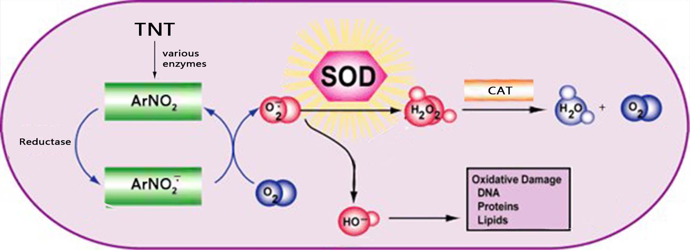
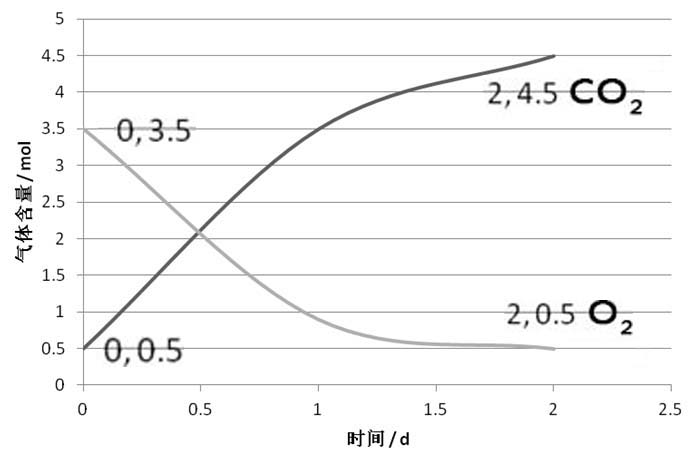

## Problem

【必修一大题】假定你是李华，你的外国交换生朋友 Steve 正在水本科毕业论文，请根据高中生物所学内容，帮他完善以下论文选段。

**闪电苦力怕的 TNT 诱导及其生物发电技术实践**  
**TNT-Induced Mutation of Charged Creepus Explodus and Its Bioelectricity Generating Technology**  
Steve Mahjong, Alex Macrohard. [J]MineNature Volume 817, Issue 1926. 2021. PP 9960-9961

**摘要：**苦力怕（Creeper，学名 Creepus Explodus，另译爬行者）是主世界中常见的友好生物。本文回顾了前人对三硝基甲苯诱导苦力怕突变的研究成果，提出了利用闪电苦力怕实现生物发电的构想，并初步完成了闪电苦力怕发电机的建造、试运行和效率分析工作，为后续同类型研究提供借鉴。

 

（Fig 1：TNT 毒理）（Fig 2：气体含量曲线）

**引入 1：**三硝基甲苯（TNT）具有相对较高的细胞毒性，其体外半数致死浓度 $\mathrm{LC_{50}} \approx 25 \ \mathrm{\mu mol \cdot L^{-1}}$​。氧化应激是被广泛认可的 TNT 中毒机制之一，其具体原理如 Fig1 所示。该理论认为，TNT 进入细胞后经过某些酶的催化，生成多种 `______`（图中 $\mathrm{ArNO_2^{\frac{}{\cdot}}}$​、$\mathrm{O_2^{\frac{}{\cdot}}}$​）攻击和破坏细胞内各种执行正常功能的生物分子（如攻击 DNA 可能引起 `________`），导致细胞衰老或损伤。为抵消 TNT 对生物体稳态的影响，生物体体内的超氧化物歧化酶（SOD）可催化有害物质歧化并最终由 `__________`（CAT）催化分解为无害物质。CAT 在动物 `____`（填器官）中含量丰富。

**引入 2：**苦力怕体内的 CAT （简记为 CrpCAT）具有极其特殊的结构。Notch Persson 的实验表明，CrpCAT 的活性高于其它动物体内的 CAT，其具体实验步骤如下：

>步骤 1：取 3 支洁净的试管在适宜温度下保温，分别加入 $2 \mathrm{mL}$​​ SOD 催化产物溶液。
>
>步骤 2：分别向 3 支试管中滴加 2 滴一定浓度的 $\mathrm{FeCl_3}$ 溶液（A 组）、`__________`（B 组）、`__________`（C 组）。
>
>步骤 3：一段时间后，精确测定各组反应速率，测得 $v(A) = 9.85 \times 10^{-10} v(B) = 2.11 \times 10^{-10} v(C)$​，从而证明了实验结论。

该实验的 B 组与 C 组相较，可以说明 CrpCAT 的 `____`（选择：A. 高效性；B. 专一性；C. 温和性；D. 以上选项均不能说明）

**引入 3：**苦力怕 CrpCAT 的高活性使其可以耐受较高浓度的 TNT。用 TNT 处理苦力怕可诱导其突变为罕见的闪电苦力怕（Charged Creeper）变种。Jeb Bergensten 的研究揭示了闪电苦力怕的发电原理。在闪电苦力怕的发电器官中，电细胞细胞膜上的钠钾泵消耗细胞呼吸产生的 `__________` （填物质名称）逆浓度梯度转运钠、钾离子建立起静息电位；而动作电位时，细胞后膜上大量电压门控钠离子通道以 `________` 的方式转运钠离子进入细胞，在前后膜之间形成 $\mathrm{50 \ mV}$ 到 $\mathrm{150 \ mV}$​ 的电位差。

**实验：**研究小组初步探究了利用闪电苦力怕发电器官进行生物发电的可行性。将完整的发电器官浸泡在营养液中，在其背侧和腹侧插入电极并连接电流表，整个实验器材置于密闭气缸中，测定气缸中 $\mathrm{O_2}$​ 和 $\mathrm{CO_2}$​ 含量的变化曲线如 Fig2 所示。据图推测闪电苦力怕无氧呼吸的有机产物为 `________`，实验时间内有氧呼吸消耗葡萄糖 `______` $\mathrm{mol}$​。该发电机输出了 $b \ \mathrm{kJ}$​ 电能，计算其发电效率为 `____________`（$发电效率 = \frac{输出电能}{输入的化学能} \times 100 \%$​，已知 $\mathrm{1 \ mol}$​ 葡萄糖折合能量 $a \ \mathrm{kJ}$​​，只考虑葡萄糖的呼吸分解）。该发电机的发电效率不高，其主要原因为 `________________________________________`（从能量转化角度分析，答两点即可）

**参考文献：**[魏桐,周阳,杨治林,等. 典型炸药的毒性效应及其作用机制研究进展[J]. 含能材料,2019,27(7):558-568.](http://www.energetic-materials.org.cn/hncl/article/html/CJEM2019068)

其他参考：

+ [电鳗发电的原理是什么？ - 混乱博物馆的回答 - 知乎](https://www.zhihu.com/question/19901924/answer/1490619635)
+ [苦力怕 - Minecraft Wiki，最详细的我的世界百科](https://minecraft.fandom.com/zh/wiki/%E8%8B%A6%E5%8A%9B%E6%80%95)

## Answer

```
1) 自由基 基因突变 过氧化氢(H2O2) 肝脏
2) 2滴一定浓度的CAT溶液 2滴等浓度的CrpCAT溶液 D
3) 三磷酸腺苷 协助扩散
4) 酒精 0.5 b/a*100% 大量能量以热能的形式散失、大量能量存留在无氧呼吸产生的酒精中、呼吸作用产生的能量还需用于其它各项生命活动
```

## Solution

2 问选择题：不能说明高效性。一方面，B 组与 C 组反应速率差异仅数倍，比起酶与无机催化剂的 $10^7$​ - $10^{13}$​ 倍差异太小；另一方面，“高效性”一般只用于描述酶与无机催化剂的催化能力差异。

4 问，消耗 $\mathrm{O_2 \ 3 \ mol}$，产生 $\mathrm{CO_2 \ 4 \ mol}$，说明有氧呼吸与无氧呼吸均存在，且无氧呼吸生成酒精。根据有氧呼吸、酒精无氧呼吸方程式，有氧呼吸消耗葡萄糖 $\mathrm{3 \ mol \times \frac{1}{6} = 0.5 \ mol}$，无氧呼吸消耗葡萄糖 $\mathrm{\left( 4 \ mol - \left( 0.5 \ mol \times 6 \right) \right) \times \frac{1}{2} = 0.5 \ mol}$，共消耗葡萄糖 $\mathrm{1 \ mol}$，据此计算即可。
