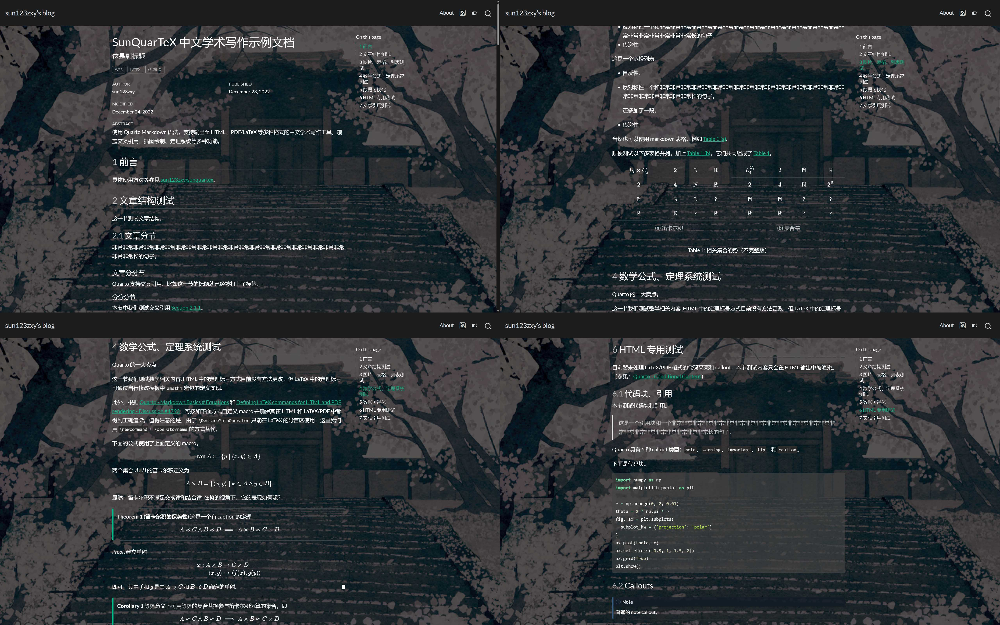

# Jekyll 2 Quarto: Academic Writing’s not All About PDF
sun123zxy
2022-12-26

## 旅程继续

[上回说到](../..\posts/20210817-aboutblog)，sun123zxy 同学完成了手撸 Jekyll 的伟大壮举，然后悠哉游哉地度过了他的高三生活。现在，静态博客的大厦已经基本落成，剩下的只是一些装修工作。然而，几朵不大不小的乌云却总让他感到不安。

sun123zxy 曾写过一篇相对严谨的学习笔记[等价类计数：Burnside引理 & Polya定理](../..\posts/20200321-burnside)，还有一篇关于行列式与生成树计数的笔记尚未发布。这些笔记里包含大量章节标号、定理与交叉引用。关于交叉引用，原生 Markdown 只支持在链接处以 section 的标题作为标签完成引用，显然对中文文档不大友好。不少人选择使用内嵌 HTML 解决问题，但死脑筋的 sun123zxy 认为这种方式背离了 Markdown 简化格式的初衷。后来他发现，[PHP Markdown Extra](https://michelf.ca/projects/php-markdown/extra/) 格式的 Special Attributes 能解决部分交叉引用的问题，更惊喜的是 Pandoc 竟然兼容这种语法（当时 sun123zxy 对 Pandoc 还没有做深入了解，只局限于使用 jekyll-pandoc 渲染而已）。至于处理章节标号，只需对已经写好的目录系统脚本做一点改动即可，而且当时 sun123zxy 也并没有那么多篇严谨的学术向写作。总之，问题暂时得到解决。

另一朵乌云来自 LaTeX。众所周知，Markdown 的内嵌数学公式是 LaTeX Math Mode 的某个子集。sun123zxy 发现，自己在 LaTeX 上的不求甚解开始给他带来各种麻烦。比如，他无法解释为什么只有 `aligned` 环境能被正确渲染，而不少教程中提到的 `align*` 和支持标号的 `align` 却总是报错；再比如，由于使用了重视速度的 [KaTeX](https://katex.org/) 而不是更加完备的 [MathJax](https://www.mathjax.org/) 作为渲染引擎，他发现自己无法使用诸如 `\newcommand`、`\DeclareMathOperator` 的宏定义。而且，一些教程中提到的 `physics` 等需要自行导入的“宏包”也让他摸不着头脑。

最重要的是，sun123zxy 开启了他的大学生活，论文写作的需求使他产生了系统学习 LaTeX 的想法。他在网协大牛那里听说了 [Overleaf](https://www.overleaf.com/)，并在间歇性热情驱使下疯狂啃食文档，最终写出了自己的文档类，覆盖常见中文社科、科技向论文写作需求。验之以文，效果拔群。学习过程中，sun123zxy 习得众多排版常识，掌握了各种 font family 的区别、衬线字体的使用情景、英文 dash 的分辨方式等技巧，姿势水平得到质的飞跃。

sun123zxy 发现自己有点沉迷 LaTeX 了。他在写集合论大作业时学习了 `amsthm` 宏包，现已完全抵挡不住“定理 2.3”、“推论 4.1.1”、“例题 3.2”、“图 3”、“表 1”自动标号和交叉引用的诱惑。曾经博客使用的加强版 Markdown 在完备的 LaTeX 面前不值一提。他突然感觉有点害怕，毕竟 PDF 格式的网络发布效果并不理想。他需要找到一种能兼取两种格式长处的解决方案，否则他的博客将成为历史的眼泪。

然而在这里他遇到了瓶颈。尽管已经有一系列形如 LaTeX2HTML 的项目存在，但因为 TeX/LaTeX 是为 PDF 等页面固定的展现方式而设计，在转换成尺寸动态变化的网页（HTML）时必然面临信息损失。[Markdown or LaTeX? - Yihui Xie \| 谢益辉](https://yihui.org/en/2013/10/markdown-or-latex/) 这篇文章详细的讨论了 Markdown 和 LaTeX 间不可调和的冲突。更好的思路是，利用轻巧且可读性优秀的 Markdown 作为写作语言直接输出 HTML，需要 PDF 时再使用其它程序处理得到 LaTeX 代码。[markdown 宏包](https://ctan.org/pkg/markdown)就解决了这样的问题。

> 「你喜爱的 Markdown 写作，现更以 LaTeX 呈现。」
>
> ——[以 Markdown 撰写文稿，以 LaTeX 排版 \| 始终](https://liam.page/2020/03/30/writing-manuscript-in-Markdown-and-typesetting-with-LaTeX/)

markdown 宏包提供的 hybrid 功能还提供了将 LaTeX 命令混入 Markdown 的功能，完美覆盖了上述使用情景。然而，Markdown 自身在学术写作方面的固有缺陷——难以交叉引用、无法自动编号、没有定理系统——仍然让 HTML 输出举步维艰。问题在这里似乎陷入了死结：既想要 Markdown 的可读性和 HTML 输出，又想要 LaTeX 的定理系统和 PDF 输出——这可能吗？

sun123zxy 询问了不少同时掌握 Markdown 和 LaTeX 的大佬，他们都没有研究过这样的问题。唯一的希望是：找到一种合适的方式扩展 Markdown 的语法。sun123zxy 想起了 [Pandoc](https://pandoc.org/)——文档转换界的瑞士军刀。事实证明 Pandoc 确实对得起这个称呼。他离解决方案已经非常近了：[Pandoc’s Markdown](https://pandoc.org/MANUAL.html#pandocs-markdown) 已经非常强大，强大到可以随意内嵌 LaTeX 代码（当然只对 LaTeX 输出有效），交叉引用几乎任何内容，甚至可以用 Markdown 风格的 fenced syntax 控制 HTML 中的 `div`、`span` 及其参数！再加上 [pandoc-xnos](https://github.com/tomduck/pandoc-xnos) 插件提供的自动标号功能，问题几乎得到全部解决——而现在看来，定理系统也可以通过编写 Pandoc filter 实现。

当然，sun123zxy 是个懒人，在能搜到解决方案的情况下，他不会干重复造轮子的傻事。某日，sun123zxy 又开始他了的头脑风暴。通过 Google 新的关键字 `markdown`、`cross-reference`、`academic writing`，他发现了 [R Markdown](https://rmarkdown.rstudio.com/)，进而发现了 [Quarto](https://quarto.org/)。

> Quarto is an open-source scientific and technical publishing system built on Pandoc.
>
> - Create dynamic content with Python, R, Julia, and Observable.
> - Author documents as plain text markdown or Jupyter notebooks.
> - Publish high-quality articles, reports, presentations, websites, blogs, and books in HTML, PDF, MS Word, ePub, and more.
> - Author with scientific markdown, including equations, citations, crossrefs, figure panels, callouts, advanced layout, and more.
>
> ——几乎让我一下子跳起来的 Overview

Quarto 是构建在 Pandoc 上的文档发布系统，对 Pandoc’s Markdown 做了进一步扩展以适应学术写作，其中就包含了 pandoc-xnos 的语法和——用 Pandoc’s Markdown 的 fenced syntax 实现的定理系统！此外，Quarto 甚至还支持 Jupyter Notebook 的动态计算，附上 Matplotlib 代码就可动态生成统计图表——而且同样也可以被交叉引用！更让人欣喜的是，除了直接输出 HTML 和 PDF/LaTeX，Quarto 还提供了类似 Jekyll 的生成静态网站的功能！

于是，长达数月的探索终于落下帷幕，语法学习、环境配置与博客迁移被提上日程。又是近一个月的辛勤劳动，sun123zxy 终于完成了写作流程的构建和博客的搭建工作。盯着桌前已经冷透了的保温杯，他陷入了沉思……

## 主要成果

- 基于 Quarto 的 [SunQuarTeX](https://github.com/sun123zxy/sunquartex) 多格式中文学术写作出版流程，内含适用于常见中文论文写作的 LaTeX 文档类及其示例文档。
- Quarto 驱动的适应学术写作要求的[新版博客](https://blog.sun123zxy.top)（[sun123zxy/blog-quarto-code](https://github.com/sun123zxy/blog-quarto-code)）。

上一个 Jekyll 博客，一砖一瓦都是自己搭出来的，有感情了（笑）。所以也没下线，放在 [blog-jekyll.sun123zxy.top](https://blog-jekyll.sun123zxy.top) 上了。如果你也和我一样怀旧，可以去看看~

那么，依照惯例，聊聊学习与折腾中的一点心得体会。

## 关于 LaTeX

很多人说 LaTeX 不好学——的确。即使是 OIer 群体，对 LaTeX 的认知也大多停留在数学公式水平。然而比起客观的困难，更应该问的问题是——Why LaTeX? 不同人的答案或许有所不同，但应有以下几点：

- 有学术写作或打印文档的需求（否则可直接使用 Markdown/HTML）
- 认同内容与样式分离的设计思想，希望对文档排版有清晰的控制，而不是所见即所得的富文本格式导致的混乱。
- 希望用相对不易损坏且可读性较高的代码式文档替代 `.docx` 式的黑箱存储。
- 需要使用章节标号、定理系统等交叉引用功能。
- 想用简洁的代码生成严谨美观的数学公式。
- ~~就是感觉 LaTeX 排出来的东西很牛逼~~

学习 LaTeX 需要了解它的历史，理解它的开发理念，理清 TeX/LaTeX 的历史进程，弄清 pdfLaTeX、XeLaTeX、LuaLaTeX 各自的特点，在 MikeTeX、TeXLive 两个发行版中做出选择，学习 BibTeX 引用管理格式，还有对排版知识的初步了解——知识体系可谓庞大。此外，不少 LaTeX 教学文档、各种宏包的手册本身就是由 LaTeX 生成的，这意味它们都是 PDF 格式，无法在互联网上得到很好的传播。但请不要忘记，它们是学习 LaTeX 的第一手资料。例如，[CTAN](https://www.ctan.org/) 上的手册是学习各类宏包的第一途径，[LaTeX 官网](https://www.latex-project.org/help/documentation/)也提供了不少相对系统的 PDF 教程。当然，近年来网页渲染工具 [Overleaf](https://www.overleaf.com/) 的出现降低了环境配置的难度，[Overleaf 的 LaTeX 教学文档](https://www.overleaf.com/learn)也非常优秀。我还强烈推荐 [一份其实很短的 LaTeX 入门文档 \| 始终](https://liam.page/2014/09/08/latex-introduction/) 这篇文章作为入门，作者是一位参与维护 CTeX 宏集的大佬，之前提到的 markdown 宏包他也写过一篇详细的介绍，详见上文引用中的链接。

在互联网上碎片化的学习 LaTeX，一定要经常问自己——这功能是哪个宏包定义的？例如，关于交叉引用，`\label`、`\ref`、`\pageref` 均为原生自带，`\eqref` 是 `amsmath` 宏包定义的，而 `\autoref` `\href` `\url` 均为 `hyperref` 宏包的命令，引入 `hyperref` 的目的主要是让文章里的交叉引用都变成 PDF 里可点击跳转的超链接；再例如，定理系统是 LaTeX 原生支持的，但 `amsthm` 提供了无标号版本的定理、设置 `\theoremstyle` 的方式和自动添加 QED symbol 的 `proof` 环境。再次强调，不要错过宏包的 PDF 手册！阅读手册是整合碎片知识、查漏补缺的最佳途径。

## 关于 CTeX

此外，有必要对中文排版基础宏包 [CTeX](https://ctan.org/pkg/ctex) 做进一步说明。

> 最初，Knuth 在设计开发 TeX 的时候没有考虑到多国文字支持，特别是对多字节的中日韩表意文字的支持。这使得 TeX 以至后来的 LaTeX 对中文的支持一直不是很好。即使在 CJK 宏包解决了中文字符处理的问题以后，中文用户使用 LaTeX 仍然要面对许多困难。这些困难里，以章节标题的中文化为最。由于中文和西文书写习惯的差异，用户很难使用标准文档类中的代码结构来表达中文标题。于是，用户不得不对标准文档类做较大的修改。除此之外，日期格式、首行缩进、中文字号和字距等细节问题，也需要精细的调校。我们设计 CTeX 宏集的目的之一就是解决这些 LaTeX 文档的汉化难题。
>
> 另一方面，随着 TeX 引擎和 LaTeX 宏包的不断发展，LaTeX 的中文支持方式从早期的专用系统（如 CCT）发展为适用于不同引擎的多种方式。这些方式的适用情况和使用方式有不少细节上的差异，同时操作系统的不同、语言环境的不同等客观情况又进一步带来了更多的细节差异。我们设计 CTeX 宏集的另一个主要目的就是尽可能消除这些差异带来的影响，使用户能够以一个统一的接口来使用不同的中文支持方式，使得同一份文档能够在不同环境下交换使用。
>
> ——CTeX 宏集手册 - 第 1 节：介绍

CTeX 的基础使用，我仍然推荐上面始终的入门文档。[LaTeX 中文字体配置基础指南 - 知乎](https://zhuanlan.zhihu.com/p/538459335)对我的帮助也很大。如果打算进一步自定义样式建立自己的文档类，还得沉下心来研读手册。

## 关于 Pandoc

Pandoc 其实一直致力于扩展 Markdown 的语法使其适合学术写作。[TUG 2020 — John MacFarlane — Pandoc for TeXnicians](https://www.youtube.com/watch?v=T9uZJFO54iM) 的演讲几乎涵盖了所有值得关心的问题。

我认为 Pandoc 已有能力成为下一代学术写作的终极解决方案。语法上，Markdown 简洁易读，语法天然与格式解耦（反例是 LaTeX），而 Pandoc’s Markdown 是 Markdown 方言的集大成者，交叉引用、文献引用、图表等 Markdown 原生痛点都有很好的支持，fenced syntax 甚至可以视为 LaTeX environment 的平替；技术上，Pandoc 已经是非常成熟的格式转换工具，而 Pandoc filter 好比 LaTeX 中的 documentclass 和 style 文件，事实上实现了 Markdown 中的“宏定义”。如社区进一步发展，大部分常用 filter 能像在 LaTeX 中引用 documentclass 一样轻松获取，我们就能真正告别格式的困扰，拥抱 Pandoc’s Markdown 治下的多格式学术写作。

从这角度来看，Quarto 似乎更像是 Jupyter、Jekyll 和一堆 Pandoc filter 的混合物（笑）

## 关于 Quarto

Quarto 首个 Release 距今不到 2 年，是相当年轻的项目。开发 Quarto 的团队之前主要维护 R Markdown，Quarto 是他们跳出 R 语言生态圈，将成果扩展至更广阔生态圈（如 Python）的尝试，这也意味着项目尚存不尽人意之处。把它调理成满意的模样，还真得花不少功夫。~~甚至让笔者开了人生首个正经 issue~~

### SunQuarTeX

使用 Quarto，我主要有两大需求——论文多格式输出和静态博客生成。两个需求相对独立，因此有必要将离线论文输出的功能单独抽象出来。折腾的结果就是 [SunQuarTeX](https://github.com/sun123zxy/sunquartex)。Quarto 原生的 HTML 输出还不错，自带目录高亮还有引用提示，稍微改改就能用了。关于自定义，Quarto 使用 SCSS 作为 CSS 生成器，意味着可以直接通过修改变量或 `@extend` 完成大部分工作。参考以下文档：

- [Quarto - HTML Theming](https://quarto.org/docs/output-formats/html-themes.html)
- [Quarto - More About Quarto Themes](https://quarto.org/docs/output-formats/html-themes-more.html)
- `quarto-cli` 下的 `/src/resources/formats/html/bootstrap/`：内有 Quarto 的 SCSS 定义，目录下还有各种官方主题的 SCSS 文件，可作参照。Tip: 善用 Github 搜索功能！

我这边的修改主要是把定理做成了 callout 的样式，另外给 proof 尾部加了 QED symbol。

难绷的是 PDF，直接生成效果可谓一言难尽……还好，与 Pandoc 相似，Quarto 提供了设置 `template` 的功能，可使用稍加改动的 LaTeX 文件作为生成模板，从而完全控制文章 LaTeX 的生成方式，进而控制 PDF 输出的样式。可参考以下文档食用：

- [complex thesis with quarto · Discussion \#2543 · quarto-dev/quarto-cli · GitHub](https://github.com/quarto-dev/quarto-cli/discussions/2543)
- [Quarto - Article Templates](https://quarto.org/docs/journals/templates.html#templates)

当然，这得在已有成熟 LaTeX 模板的前提下才能进行，所以还是得会 LaTeX（笑）。使用过程中笔者也发现生成的 LaTeX 的某些细节不太合理（如 [Issue \#3736](https://github.com/quarto-dev/quarto-cli/issues/3736)，详见 SunQuarTeX 仓库 README），当然也无伤大雅，且等开发团队慢慢完善吧。

### Blog

有了前面的基础，再搭博客也就容易了。以笔者一贯的风格，博客样式都是要操刀大改的（上一个甚至直接从零手撸了 XD），这次工作却意外的少。一方面考虑到毕竟不在 CS 专业，写那么多祖传代码之后维护也是麻烦事；另一方面嘛……

> 这，谁写的这 `darkly` 这主题，绿不拉几的
>
> 看一眼
>
> `#00bc8c`，啊这样
>
> 草
>
> 这样啊这样
>
> 加个背景
>
> ……
>
> ？
>
> ？？？
>
> 好像还挺配的？
>
> ——来自考试周还在摸鱼的 sun123zxy 的惊叹

light mode 的 `flatly` 也还不错，直接丢上去没改了。唯一的缺憾是 [Issue \#3705](https://github.com/quarto-dev/quarto-cli/issues/3705)，按开发组成员的回复来看，短期内 light mode 和 dark mode 的相互分离还不能实现。

此外，关于代码高亮的自定义方式，可参考以下要点：

- [Quarto - HTML Code Blocks \# Highlighting](https://quarto.org/docs/output-formats/html-code.html#highlighting)
- `quarto-cli` 下的 `/src/resources/pandoc/highlight-styles/`：内有官方样式文件，可作为模板。
- 行内高亮不能在 `.theme` 中更改，可通过覆盖 SCSS 的 `$code-color` 设置。

## 画廊

