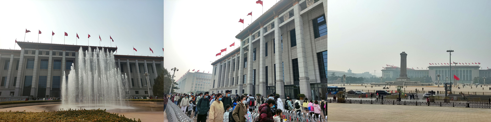
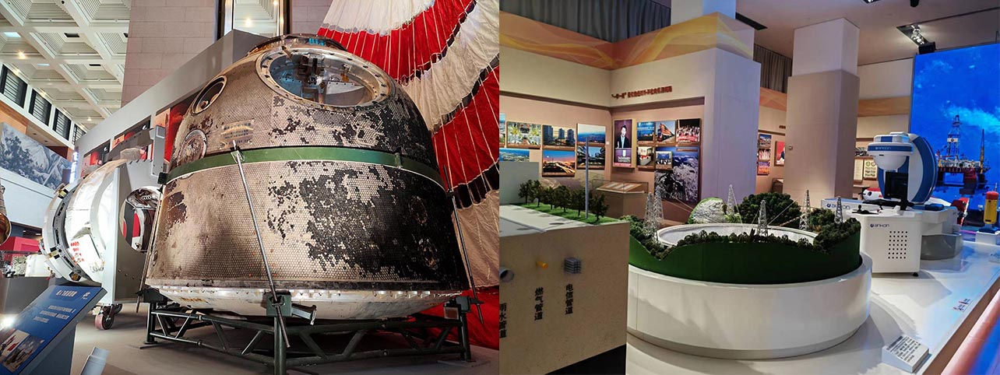
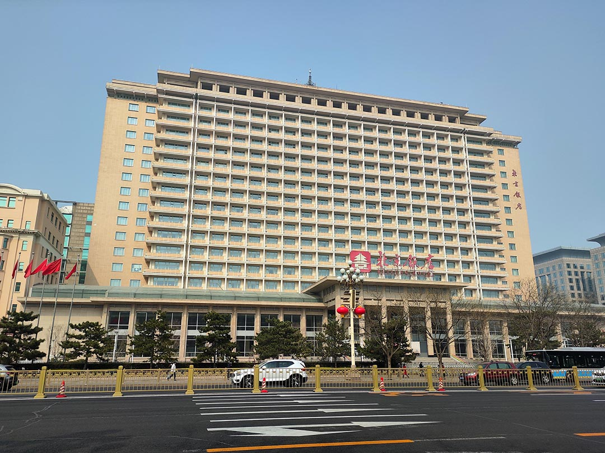
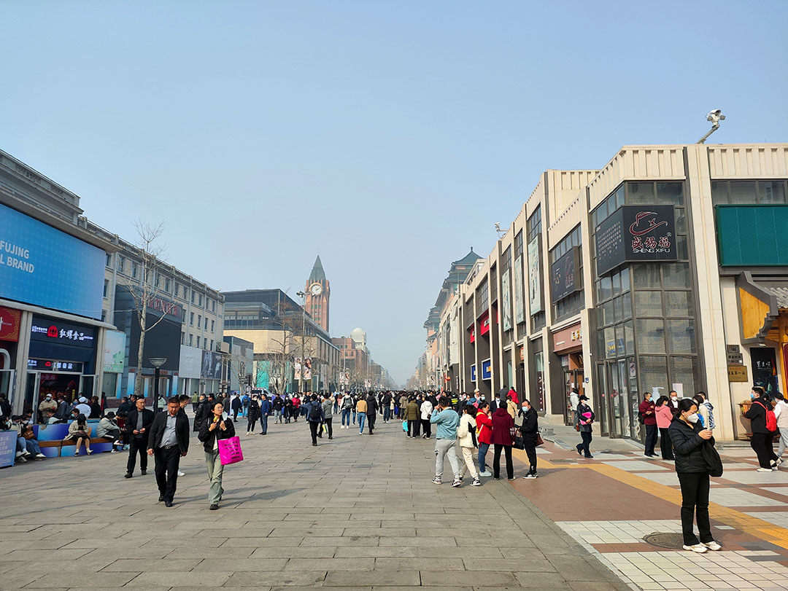
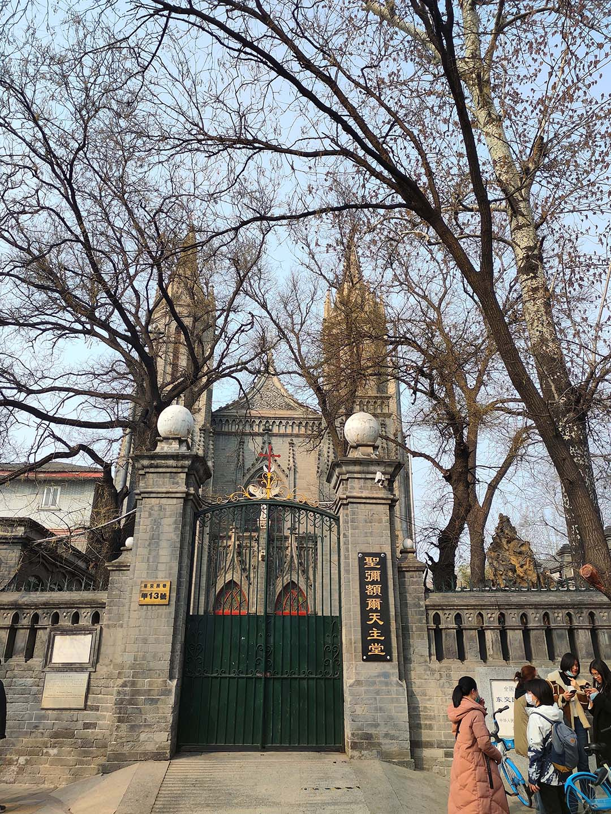
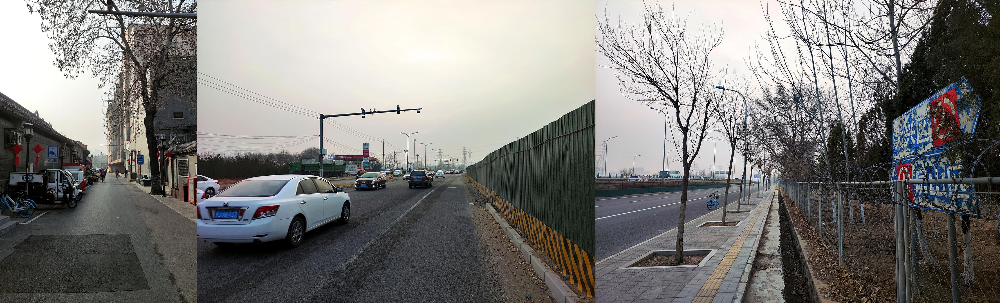

“来北京，当然要逛逛啊！”嘴上这么说，充实的学习生活却总能带来无数个宅在宿舍的理由。恰逢本学期思政课需亿点社会实践，国家博物馆乃官方推荐之所，而东可游长安街、王府井，南可观东交民巷，完成任务而了却游园之心，岂不美哉？虽开学未几，春景未至，然天气渐暖，今日不去，更待何时？不妨早做打算。遂与室友相约，周日出游。

乘地铁至天安门东，一路罚站。当然毕竟是淡季，车上并不拥挤。惊奇地发现一号线已非昔日模样：站台已加装护栏，而列车的内饰也早已翻新。

例行排队安检，上至天安门广场东侧。国家博物馆就在眼前，隔天安门广场与人民大会堂遥相呼应。馆子很大，上上下下一共六层，尚分南北两区，一整天或许也很难逛完，故我们只选取少量展馆参观。

展览当然是相当不错的，但具体说来却没啥好写。博物馆这种地方，始终还是得自己去看。常设的《复兴之路》展区是标准的《中国近现代史纲要》，最近也新开了新时代展区，但我们去的时候……空无一人……（逃）

总之，逛逛逛拍拍拍，出来已经一点半了。讨论一下，准备往东单走找地儿吃饭。走在东长安街的人行道上，公安部、生态环境部、~~长安俱乐部~~滚滚而来，赫赫有名的北京饭店也映入眼帘。

王府井的人气似乎已经恢复了八成。我们并无兴致逛街，草草填饱肚子，往南向东交民巷前进。

比起嘈杂的天安门广场，东交民巷可谓意外的宁静。从东侧进入东交民巷，街上行人三三两两，似乎都是本地居民。往东前进，法国邮政局、西班牙领事馆等欧式建筑在街边排列，但均未开放游览，亦无游客驻足。灰黑色的砖瓦在紧闭的大门后默默不语，枯树残影的映衬下略显凄凉。教堂倒是小有人气，时有新人在此拍摄婚纱。行至天安门广场前最后一个路口，有警卫把守，似乎已不得入内。查看地图，前面已是公安局地界。也许得从天安门广场方向步行进入才可进一步游览吧。（事后调查，不少使馆的入口其实在前门大街一侧，许多建筑也已商业运行，除外观保持原样外，已无太多历史可寻。）

室友突然提议骑回良乡——英雄所见略同啊（笑）。从学校骑至主城一直是我的计划之一，现在离天黑尚有三四小时光景，晚 7:00 之前骑回学校并无不可。已有一室友因事先行离开，另一位室友苦于舟车劳顿，计划地铁回程。于是和提议的室友开启了近 40km 的骑行之旅。

已在东交民巷南边，我们没有选择卢沟桥路线，而是往京良路方向前进。二环可不小，出了前门公园，在狭窄的胡同间穿行，不一会就有点小累了。室友事后表示他没意识到 40km 的严重性（

渐行至三、四环外。偶然拐离干道，驶入普通道路。路上房屋低矮，矮墙垛垛，货车辆辆，尘土飞扬，加之今日有霾，揉眼一看，好似来到某西部偏远地区的乡间小路上。偌大的北京城也有如此“土里土气”的地方……之前在房山线上看到的壮美秋景，似乎也不在本次路线之上。况且春天尚未到来，即使经过也别无二致吧。

至京良路。室友体力已下降不少，速度逐渐放缓。然而调高座椅、换用前脚掌蹬车的我似乎还能一战。~~室友表示你个山区居民怎么这么能蹬，~~虽然中途因未知原因迷路多绕出几公里的路程，最终还是在 7:00 之前赶回了学校。

买了面包和咖啡匆匆赶去参加组会，坐下的瞬间，突然感觉如断电般困倦……