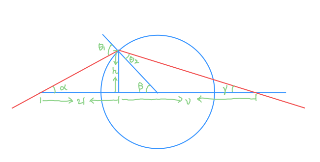
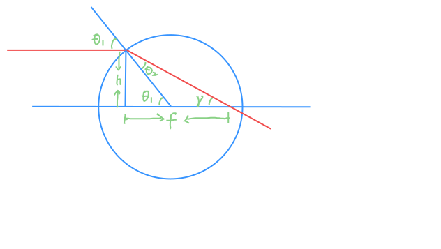
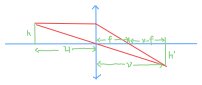

光学中，光线的传播路径满足 Fermat 原理——即光线在两点间传播的路径使得光程（optical path length）极小．折射定律（Snell's Law）可以由同介质中光线直线传播，并移动交界点求导算得
$$
n_1 \sin \theta_1 = n_2 \sin \theta_2
$$
这里 $n_1, n_2$ 分别是两介质的折射率，$\theta_1, \theta_2$ 分别是入射角和折射角．

下面仅依赖 Fermat 原理和 Snell 定律解析薄透镜的成像原理．策略上，我们先处理单面透镜，然后推广到双面薄透镜；先证明单点成像清晰，再通过过光心光线和平行光交叉得到成像位置．

## 单面透镜

假设单面球面透镜是一个球面半径为 $R$ 的球面，折射率为 $n_1$，球面外折射率为 $n_0$，光线只进不出．

### 单点成像

因为单面球面透镜具有旋转对称性，不失一般性，可以选取物点在主光轴上．设：

- 物点与入射点距离为 $u$，射出方向与主光轴夹角为 $\alpha$
- 折射点与主光轴距离为 $h$，与球心连线与主光轴夹角为 $\beta$
- 折射面入射角为 $\theta_1$，折射角为 $\theta_2$
- 出射光线与主光轴夹角为 $\gamma$，与主光轴的交点与入射点水平距离为 $v$

则可列方程组

:::{layout-ncol=2}
$$
\begin{aligned}
\tan \alpha &= \frac{h}{u} \\
\sin \beta &= \frac{h}{R} \\
\theta_1 &= \alpha + \beta \\
n_0 \sin \theta_1 &= n_1 \sin \theta_2 \\
\gamma &= \beta - \theta_2 \\
\tan \gamma &= \frac{h}{v} \\
\end{aligned}
$$

{#fig-optic-image}
:::

考虑近轴情形，即认为 $h$ 很小，这样 $\alpha, \beta, \gamma$ 也很小，可以一阶近似，算得
$$
\frac{n_0}{u} + \frac{n_1}{v} = \frac{n_1 - n_0}{R}
$$
这里 $v$ 与真实像点相差一个 $o(h)$．当 $h$ 很小时，可以认为 $v$ 只与 $u$ 有关，从而所有从物点光线聚焦于一处，故在此处成像清晰．

:::{.remark}

不可忽略的 $h$ 会导致球面像差．
:::

### 焦距

平行光入射单面透镜时，设折射点与主光轴距离为 $h$，出射光线与主光轴夹角为 $\gamma$，与主光轴的交点与入射点水平距离为 $f$，折射面入射角为 $\theta_1$，折射角为 $\theta_2$，如图列出方程组

:::{layout-ncol=2}
$$
\begin{aligned}
\sin \theta_1 &= \frac{h}{R} \\
n_0 \sin \theta_1 &= n_1 \sin \theta_2 \\
\gamma &= \theta_1 - \theta_2 \\
\tan \gamma &= \frac{h}{f}
\end{aligned}
$$

{#fig-optic-parallel}
:::

同样作关于 $h$ 的近轴一阶近似解得
$$
\frac 1 f = \frac {n_1 - n_0} {n_1 R}
$$
故在无视 $o(h)$ 意义下，平行光经过单面透镜后与主光轴交点与 $h$ 无关，聚焦于距透镜 $f = \frac {n_1 R}{n_1 - n_0}$ 处．

## 双面薄透镜

现在考虑双面薄透镜．双面，是指光线还会第二次折射离开透镜，球面半径先后为 $R_1, R_2$；薄，是指忽略不计透镜厚度，假装光线在透镜中传播时与主光轴距离不发生变化．

### 单点成像

已经知道单面透镜能将物点发出的光线聚焦于某一像点，将双面薄透镜的第二次折射反向视为虚像的入射，可知双面薄透镜同样能将物点发出的光线聚焦于某一像点．

### 焦距

来计算双面薄透镜的焦距．设经过第一次折射，焦点在折射点右侧 $f_1$ 处，第二次折射时可反向考虑为从焦点 $f$ 处出发的光线入射到第二个折射面在 $-f_1$ 处成虚像，故
$$
\begin{aligned}
\frac 1 {f_1} &= \frac {n_1 - n_0} {n_1 R_1} \\
\frac{n_0}{f} + \frac {n_1} {-f_1} &= \frac{n_1 - n_0}{R_2}
\end{aligned}
$$
解得双面薄透镜焦距 / 制镜公式（Lensmaker's equation）
$$
\frac 1 f = (n_1 - n_0) \left( \frac{1}{R_1} + \frac{1}{R_2} \right)
$$

## 成像位置

设物点与入射点距离为 $u$，与主光轴距离为 $h$，成像位置与主光轴交点与入射点水平距离为 $v$，与主光轴距离为 $h'$．

由于已经证明了成像的清晰性，我们可以通过两条光线的交点确定像点位置——这一推导对单面透镜和双面薄透镜都适用．过光心的光线入射出射时法向均与垂直于折射面，故沿直线传播．平行光入射时，经过透镜后聚于距透镜 $f$ 处．简单几何推演

:::{layout-ncol=2}
$$
\frac {v-f} {f} = \frac {h'} {h} = \frac v u
$$

{#fig-optic-position}
:::

可得单面薄透镜成像公式
$$
\frac{1}{u} + \frac{1}{v} = \frac{1}{f}
$$

这一公式描述了所有靠近主光轴的物点的成像规律．